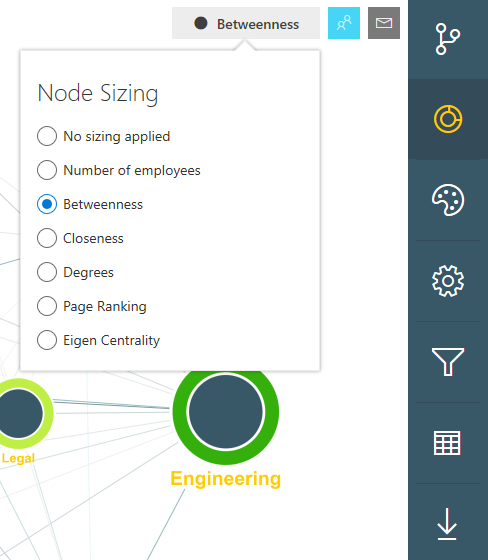

---
# Metadata Sample
# required metadata

ROBOTS: NOINDEX,NOFOLLOW
title: Organization Network Analysis Azure Template for Workplace Analytics 
description: Learn about the Organization Network Analysis Azure Template for Workplace Analytics and how to use it for advanced data analysis
author: madehmer
ms.author: madehmer
ms.date: 12/21/2018
ms.topic: get-started-article
localization_priority: normal 
ms.prod: wpa
---
# Organization Network Analysis Azure Template for Workplace Analytics

Workplace Analytics Azure Templates include the Organization Network Analysis template that enables you to visualize connections within your organization, pinpoint collaboration patterns, and drive change.

Workplace Analytics provides several metrics to help you visualize and analyze formal and informal relationships within your organization. This analysis can help you shape a business strategy that improves communication, making your business more effective and sustainable.

## To render a network analysis graph

1. In Workplace Analytics Azure Templates, select **Organization Network Analysis**.
2. Select one or more filters for the graph. The available filters match up to the HR attributes included in the imported [organizational data](../setup/prepare-organizational-data.md#step-three--export-data) from Workplace Analytics. For example, Engagement, FunctionType, KeyTalent, and LevelDesignation, as shown in the following graphic.

   

3. Select **Render Graph**. Based on the data size, it might take a few minutes for the graph to appear.
4. By default, the graph is shown in the **Network View** and **No sizing applied**. Use the following options to customize or download the graph.

   View option |Name |Description
   ------------|--------------|------------
   | No sizing applied | Changes how the data is measured and shown in the graph based on the Node Sizing option you choose.
   | Network View  | Changes how the graph shows the network, which you can view in either the **Force-directed**, **Lens**, or **Structural** layout.
    |Combined View | Changes the graph view to Combined View, which prompts you to select an HR attribute meeting metric to display the nodes for , such as FunctionType.
    | Change Node Colors | You can select to change the color of any of the nodes shown in the graph.
    | Change Settings |Scales the thickness or color darkness of the link lines. You can also use this to turn tool tips on or off for selected nodes.
    | Filter by HR attributes |Changes the filters selected for the rendered graph.
    | View as Table |Choose to see a table view of the graph data.
    | Download Graph |Choose to download the graph as a PNG file.

## Node Sizing

You can apply the following node sizing options to change how the data is measured and shown in the graph. The data and the filters you select for the graph determine what a node represents (people or groups).

### Number of employees

The node size is based on the number of people in that particular group. The larger node sizes represent the nodes with the larger number of people in that network.

### Betweenness

Betweenness is a measure of how much of a key connector a person or group (node) is in the network. This is calculated by finding the shortest paths between all nodes to all other nodes in the network and finding the number of times a node appears on the shortest path. The more times a node appears on the shortest path between other nodes, the more of a key connector that node is and therefore the higher the node’s betweenness score is.

### Closeness

Closeness finds the nodes that are closest to the other nodes in a network, based on their ability to reach them. It then calculates each node’s shortest path to every other node, then assigns each node a score based on the sum of all the paths. Nodes with a high closeness value have a lower distance to all other nodes and therefore are efficient broadcasters of information.

### Degrees

Degrees finds nodes with the highest number of links to other nodes within the network. Nodes with a high degree of links are those people or groups who have the best connections to others in the network. These people or groups can be key influencers or might just be strategically important for communication.

### Page Ranking

Page Ranking is a measure of importance based on the number of incoming connections.

> [!Note]
> When the link direction (connection) information is unavailable, Page Ranking might show a graph that is similar or the same as the Degrees option.

### Eigen Centrality

Eigen Centrality is a measure of influence that considers the number of links each person or group (node) has and the number of links their connections have, and so on throughout the network. The larger nodes represent the people or groups with high centrality and can be key influencers in their network.
As shown in the following graphic, Engineering, R&D, and Sales are key influencers that connect all the other groups.

### Intersectionality

Intersectionality is a measure of how diverse a node’s connections are. The higher the intersectionality for a node, the more that node’s connections come from other nodes. The nodes with high intersectionality can be good ambassadors and help drive collaboration for the intersecting nodes.

## Related topics

* [Workplace Analytics Azure Templates overview](./overview.md)
* [Deploy and configure Workplace Analytics Azure Templates](./deploy-configure.md)
* [Topic Analysis Azure Template](./topic-analysis.md)
