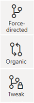
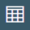
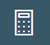
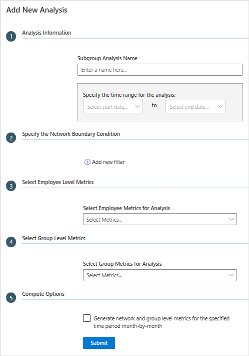
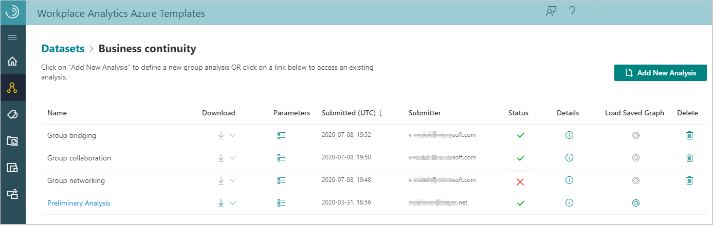
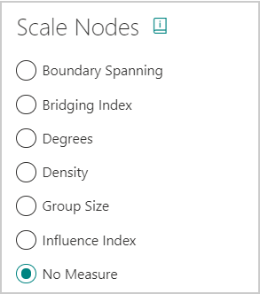

---

ROBOTS: NOINDEX,NOFOLLOW
title: Organizational Network Analysis Azure Template for Workplace Analytics 
description: Learn about the Organizational Network Analysis Azure Template for Workplace Analytics and how to use it for advanced data analysis
author: madehmer
ms.author: madehmer
ms.topic: article
localization_priority: normal 
search.appverid:
- MET150
ms.prod: wpa
ms.collection: M365-analytics
manager: scott.ruble
audience: Admin
---
# Organizational Network Analysis Azure Template for Workplace Analytics

_This template only available as part of a Microsoft service engagement._

Workplace Analytics Azure Templates include the Organizational Network Analysis template that enables you to visualize connections within your organization, pinpoint collaboration patterns, and drive change.

Workplace Analytics has a variety of measures to help you visualize and analyze formal and informal relationships within your organization. This analysis can help you shape a business strategy that improves communication, making your business more effective and sustainable.

To focus your analysis on specific subgroups or compare graphs from different time ranges or between different groups, you can create subgroup datasets and graphs within the selected (parent) dataset. For details, see  [To add new subgroup analysis](#to-add-new-subgroup-analysis).

## To add a new dataset

1. In Workplace Analytics Azure Templates, select **Organizational Network Analysis**.
2. On the **Organizational Network Analysis** page, select **Add New Dataset** at top right.
3. In **Define Analysis Settings**, enter a name and select a path to the dataset.
4. In **Select the Grouping Attributes**, select the attributes you want to analyze in the graph. The available attributes match up to the HR attributes included in the imported [organizational data](../setup/prepare-organizational-data.md#attribute-reference) from Workplace Analytics.
5. In **Specify the Interaction Types and Thresholds**, select the following.

   * **Choose the interaction type(s)** - Select what to analyze in the dataset, independently or in combination, including emails, meetings, Teams chats, and Teams calls. Note that if you include meetings and Teams calls in your analysis, only unscheduled Team calls are counted to avoid double counting meeting call activity.
   * **Max number of people involved in each interaction** - Select the maximum number of people involved in each interaction.
   * **Maximum duration of a meeting or call** - Select the maximum number of interactions between the selected groups or people.
   * **Advanced Settings** - Select to turn it **On** if you want to specify thresholds for interactions, such as a minimum number of emails, meetings, chats, calls, and interactions across two or more types.

   >[!Important]
   >When analyzing calls or chats, you'll only see data from the time period where all signals exist. For example, if you select meetings and calls to analyze and 13 months of meeting data is available, but only three months of Teams data is available, you'd only see data for the three months that include both meetings and calls.

6. Optionally, in **Enter any Exclusions**, enter one or more terms separated by a comma to exclude meetings with these keywords in the meeting subject line from this analysis. See [meeting exclusion rules](../tutorials/meeting-exclusions-intro.md) to learn more about them.
7. Select **Submit**. Based on the data size, it might take anywhere from a few minutes up to a few hours to successfully create the dataset.
8. After the analysis successfully loads, select the dataset from the list, and then select **Preliminary analysis**, which the template creates by default as a starting dataset.
9. In **Define Graph Settings**, select what HR attribute to use for the combined or grouped view and for the color of the graph's nodes. You can also select one or more filters to further focus the graph view and then select **Render Graph**.

   

    >[!Note]
    >You must select two or more HR attributes to analyze, so you have an attribute to "combine by" and one to "color by" for the graph.

10. The graph is shown in the combined or grouped view by default based on what you selected in the previous step.

    >[!Note]
    >When the node or link count exceeds the maximum threshold defined by your Azure Templates admin, the individual network view options will be unavailable. To enable these network view options, you can use filters to reduce the graph's node or link count.

11. To save the current graph for future analysis, select **Save**, enter a name, and then select **Save Graph**.

## To view graphs

1. After the analysis successfully loads (green check mark), select it from the list, and then:

   * For new graphs, select **Preliminary Analysis** and in **Define Graph Settings**, select what HR attribute to use for the combined or grouped view and for the color of the graph's nodes. You can select one or more filters, and then select **Render Graph**.
   * For previously saved graphs, select the **Load Saved Graph** icon associated with the analysis, and then select it from the list.

   >[!Note]
   >If you haven't saved any graphs yet, the list will be empty.

2. At top of the graph, you can select different dates to analyze if the analysis includes different time periods. When you change the dates, you must select **Apply** to update the graph view.

3. Use the following options to change the graph view and save new analysis.

   Option |Name |Description
   ------------|--------------|------------
   | No Measure | Changes how the data is measured and shown in the graph based on the Node Size option you select.|
   | Show or Hide Legend  | Opens or closes the legend of assigned node colors for the HR attribute shown in the graph.|
    | Link Color |Select a different color for the line links shown in the graph.|
    | Dataset Parameters |Choose to view the network parameter details that you set for the selected dataset.|
   | Network View  | Changes how the graph shows the network, which you can view in the following layouts. Note that this option is unavailable when the number of graph nodes exceeds the values set by your admin: <ul><li> Force-directed - Assigns forces among the set of edges and nodes, so they overlap as little as possible and are distributed evenly. This is a good overall view for any kind or size  of data and is useful for finding patterns and symmetries. </li><li> Organic - Spreads nodes and links apart, so multiple components are laid out with larger components in the center to help reveal underlying structures.  </li><li> Tweak - Tries to keep nodes where they are when changing measures or other graph options. This is useful for dynamic and evolving data where you don't want to rearrange the whole network or lose your mental data map for small changes.</li></ul>|
    |Combined or Grouped View | Change the graph view to Combined or Grouped View, which prompts you to select an HR attribute metric to display the nodes for, such as FunctionType.|
    | Change Node Colors | You can select to change the color of any of the nodes shown in the graph.|
    | Change Settings |Select if the link lines scale the thickness or color darkness based on total time spent between groups. You can also use this to turn tool tips on or off. For some views, you can also select to turn on or off node titles.|
    | Filter by HR attributes |Changes the filters that show in the rendered graph. This doesn't change the dataset filters or recalculate the dataset metrics. If you want to calculate new metrics for a subset, you must create a new subset of the dataset.|
    | Download as Table |Choose to download the data shown in the graph as a table (.csv file).|
    | Save Graph |Choose to save this graph as shown to load and view later.|
    | Recompute Metrics |This only appears if the analysis is filtered by HR attributes. Choose to create new subgroup analysis that recalculates the data values with the applied filters. For more details, see [To add subgroup analysis](#to-add-new-subgroup-analysis).|

## To add new subgroup analysis

Subgroup analysis enables you to compare or focus your analysis on specific subgroups within the selected dataset.

1. You can create a new subgroup in one of the following ways:

   * From the dataset page, select the dataset from the list, and then at top right, select **Add New Analysis**.
   * From within the graph view of a dataset, select the **Recompute Metrics** icon, which automatically applies the current filter settings to the **Add New Analysis** pane.

2. In the **Add New Analysis** pane, enter a name for this subgroup analysis, and then select a start and end date for the time range to analyze.

   

3. Optionally, in **Specify the Network Boundary Condition**, you can select either single or multiple network boundaries and applicable HR attributes. With multiple boundaries, you can only select one HR attribute. If you want to analyze more, create new analysis for each.

   >[!Note]
   >Metrics download is the only option available for multiple network boundaries. No visuals are available, however you can create them with new analysis.

4. In **Select Employee Level Metrics**, select which employee level metrics, such as Boundary Spanning or Bridging Index to analyze in the graph.
5. In **Select Group Level Metrics**, select the group HR attributes and group metrics to analyze in the combined or grouped view. See [Node Measures](#node-measures) for more details about these options, such as [Boundary spanning](#boundary-spanning) and [Influence Index](#influence-index).
6. In **Compute Options**, select the checkbox if you want to also analyze the monthly data for network and group level metrics.

   >[!Note]
   >This option is unavailable for the multiple network boundaries option, because multiple network boundaries and multiple time periods cannot be done in the same calculation. This also avoids long run times.

7. Select **Submit** to create the graph analysis. The system will process the analysis, which is complete when the Status changes to a green check mark.

## To view analysis

1. On the **Organizational Network Analysis** page, select the name of the dataset in the table, and then select the name of the analysis in the table.
2. The following information and options are available in the table for existing analysis:

   * When the **Status** is a green check mark, the graph analysis was successfully saved and can be viewed.
   * If the analysis fails with the **Status** of a red X, select the **Job Details** (i) icon next to status to view details and see what might've caused the failure.
   * Select a table column heading, such as **Name** or **Submitted**, to sort by it.
   * Select the **Parameters** icon next to the name to view them for the analysis in that row.
   * Select the **Load Saved Graph** icon to view any graphs saved for that analysis. The list will be empty if no graphs have been saved yet.
   * Select the **Delete Analysis** (trashcan) icon to delete the analysis from the list.
   * Select the **Download** icon to download one of the following as a .csv file.

     * **Download metrics** for the person and group metrics in the saved subgroup graph analysis, which are based on the selected date range and other options. For example, Boundary Spanning will have multiple values based on the attributes selected for the graph.
     * **Download interaction matrix** for the PersonID interactions and related data, such as date range and connection weights by hours and counts.

     > [!Important]
     > When you calculate metrics in a **Download interaction matrix** file, know that your calculations might be different than the metrics calculated in a group-level download file. These differences occur because a person's HR attribute values can change over time and the calculations in the different downloads only use a snapshot of the latest available HR values.

   

## Node Measures

Each dot or node in the template's network graph represents either an employee or a group. The lines between the nodes represent connections, which are collaborative relationships between the connected employees or groups.

The node measures for employees are de-identified to maintain their privacy. Group node measures represent the group's measures, such as for a department (Sales) or a functional group (program managers) within the organization.

You can size the nodes and connections based on what you want to highlight by using the Scale Nodes option (No Measure by default) at the top. The following shows the measure options available for the *Combined or Grouped View* of the graph, which include *Density* and *Group Size* as an additional Scale Node options that are only available in this view.

### Boundary Spanning

Boundary Spanning measures the extent to which employees act as a representative of their group  across the organization. It indicates how people or groups are connecting to and sharing information with others in the organization.

Based on a defined group, Boundary Spanning measures the time an employee or group spends collaborating with other groups, with a boost for the diversity of their connections (number of groups). This does not consider ties inside their own group.

The network boundary is the largest group within your dataset. People that don't meet the filter conditions are excluded from the analysis. For more details, see the [measure calculations](ona-metric-calculations.md#boundary-spanning).

### Bridging Index

Bridging Index is the number of times a person or group is on the most probable path of information flow between two other people or groups. Meaning these nodes represent the potential control over the flow of information in your organization.

High values can indicate gatekeepers, liaisons, or change agents. Can be advantageous or stressful playing this role. The periphery may be less influenced by others. For more details, see the [measure calculations](ona-metric-calculations.md#bridging-index).

### Degrees

Degrees measures the highest number of links to other nodes within the network. Nodes with a high degree of links are those people or groups who have the best connections to others in the network. These people or groups can be key influencers or might just be strategically important for communication.

Degree centrality is based on the number of edges connected to a node. The overall degree is the number of incoming and outgoing edges connected to a node. For more details, see the [measure calculations](ona-metric-calculations.md#degrees).

### Density

This option is only available in the Grouped View. Density measures the number of actual connections out of the number of possible connections within a network or subgroup in a table view. Higher density indicates higher levels of connectivity. Large groups tend to have small values since it's more difficult for everyone to connect with everyone else, so be cautious when comparing across groups. Dense groups indicate cohesion between members.

When viewing Density graph data, the higher density (orange) and lower density (blue) cells are highlighted based on the modularity. The color indicates whether a group is more or less connected in the network, as compared to what's expected with a random network. If no cells are colored, the groups are as dense as expected with no outliers.

A group is *orange* when it's higher in density and *blue* when it's lower in density than what's expected. The cells are not colored by the value of the density in the table, they are colored based on the modularity. The colors are only shown in the metrics download (.csv) file and not in the table view in the template. For more details and what modularity and density ratios are, see the [measure calculations](ona-metric-calculations.md#density).

### E-I Index

The E-I index is only available in downloaded data. It indicates the size of an imbalance between external and internal collaboration for an individual within a group or for a group. This is helpful in identifying individuals or groups who are at risk of being siloed.

The E-I index is between -1 (all collaboration is internal) and 1 (all communication is external facing). A value of 0 represents a balanced amount of internal and external collaboration. This measure accounts for weighted edges but does not account for direction. An E-I index of -0.67 corresponds to a 5:1 internal to external collaboration. Hence, values at or below -0.67 indicate a group or individual might be at risk of being siloed. In this measure, an individual can only belong to one group. For more details and the difference between individual and group index measures, see the [measure calculations](ona-metric-calculations.md#e-i-index).

## Group Size

This measure is only available in the *combined view*. It represents groups based on the number of people in the same group (share the same attribute) for the selected time period. It helps you determine how the group size can affect their interactions.

> [!Note]
> Filtering will not change group sizes.

### Influence Index

Represents the number of links each person or group (node) has and the number of links their connections have, and so on throughout the network. The larger nodes represent the people or groups with high centrality and therefore, are considered key influencers in their network. Influence occurs from these influencers sharing information to their network, who then forward it to theirs, and so on. High values suggest the central person's or group's perspective will flow through the organization with efficiency. For more details, see the [measure calculations](ona-metric-calculations.md#influence-index).

### Qualitative Variation Index

The Qualitative Variation Index (QVI) is only available in downloaded data. It measures the diversity among the contacts (egonet) of an individual or a group. It indicates the likelihood that an individual or a group will equally interact with a variety of other groups or with only a few groups. This helps determine how much access they have to new information, which can affect their innovation abilities.

For more details about this measure, see the [measure calculations](ona-metric-calculations.md#qualitative-variation-index).

<!-- ### Reach Index

Represents the ability to access or share information across the organization while going through minimal intermediaries. Closeness Centrality calculates the average distance between a person or group and others in the network. People nodes with a high closeness value have a lower distance to all other nodes and therefore are efficient broadcasters of information. For more details, see the [measure calculations](ona-metric-calculations.md#reach-index).

> [!Note]
> Weights are not factored into Reach Index computations. Also, group-level measures are not yet available for Reach Index.
-->
## Graph notes

* **Insufficient group size** - If one or more nodes represent groups that are smaller than the set Minimum Group Size, they're combined and listed as an insufficient group (such as in the color node list). For the grouped or combined view, the insufficient group's edges and node won't show in the graph.

* **Delete a node** - If you want to exclude a node from the graph, you can use the filter options or select the node in the graph to highlight it, and then press **Delete** (on your keyboard). Before saving the graph, you can right-click in the graph, and then select **Show Hidden** to undo a delete.

* **Color-by key** - You can select specific metrics to color the graph by, such as by degrees, influence index, bridging index, and boundary spanning. The resulting graph will have nodes colored by using a heat map gradient with the following color scheme. Note that this color-by option is unavailable in Combined View.

  * The lowest values on one end of the spectrum show as *light yellow*.
  * The highest values on the opposite end show as *bright red*.
  * The nodes representing values in the middle show as variations of *orange*.

## Related topics

* [Workplace Analytics Azure Templates overview](./overview.md)
* [What's new in Workplace Analytics Azure Templates](./release-notes.md)
* [Deploy and configure Workplace Analytics Azure Templates](./deploy-configure.md)
