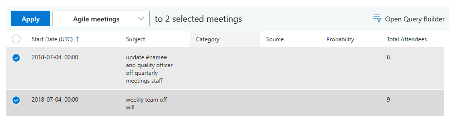
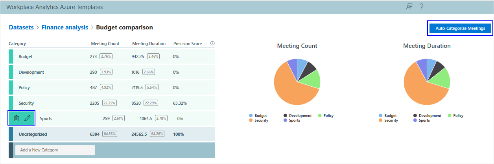

---
# Metadata Sample
# required metadata

ROBOTS: NOINDEX,NOFOLLOW
title: Process Explorer Azure Template for Workplace Analytics 
description: Learn about the Process Explorer Azure Template for Workplace Analytics and how to use it
author: madehmer
ms.author: v-midehm
ms.date: 07/24/2019
ms.topic: article
localization_priority: normal 
ms.prod: wpa
ms.collection: M365-analytics
manager: scott.ruble
audience: Admin
---

# Process Explorer Azure Template for Workplace Analytics

_These templates are only available as part of a Microsoft service engagement._

Workplace Analytics Azure Templates includes the Process Explorer template that helps you understand where your organization or team is investing or expending valuable time.

You can use Process Explorer to categorize processes, projects, meetings, and other activities. You can either upload a .csv dataset for meeting activity or connect to a blob (cloud) storage location for meeting and email activity.

After you upload a dataset, you can use the word cloud to help you decide what categories to add for analysis by viewing words found in the meeting activity. You can select category names or phrases from the word cloud to view those meetings and then categorize them.

After you categorize a good sample of meetings into the specified categories, you can:

* View meeting data based on those categories with visual charts and lists, as shown in the following graphic.
* Select to **Auto-Categorize Full Dataset** based on the sample meeting categorizations already done by you, as the analyst.
* Use the **Refine Categorization** option to create a copy of the selected analysis and add or change the categories for more in-depth analysis.

## To add a new dataset

1. In Workplace Analytics Azure Templates, select **Process Explorer**.
2. Select **Add New Dataset** (top right).
3. For **Select Dataset Type**, select either a .csv file to upload or a blob storage location, and then select **Next**. You can use a .csv file to upload meeting data or if you want to analyze email and meeting data, use the blob storage option.

   

4. Type a dataset name, locate and select the .csv file or blob storage location, and then select **Upload Dataset** (.csv) or **Run** (blob storage).
5. When prompted, select **OK**. The upload will take a few minutes to complete.
6. Your new dataset is listed in the table with the following information and actions.

   * When the **Status** changes to a green check mark, you can then select it to view existing categorizations or add a new categorization to analyze the data with.
   * Select the **Job Details** (i) icon next to **Status** to view the job details.
   * Select a table column heading, such as **Name** or **Submitted**, to sort by it.
   * Select the **Delete Dataset** (trashcan) icon to delete the dataset from the list.

## To categorize meetings for analysis

1. On the **Process Explorer** page, select the dataset name from the list.
2. What you do next depends on the dataset.

   * **For existing datasets**, select **Add New Categorization**, and then enter a title and probability threshold, same as with new datasets.
   * **For new datasets**, you're prompted to enter a categorization title and the probability threshold for the categorization. The threshold option is how likely a meeting must be in a category before it's automatically assigned to that category. Each dataset requires at least one category for analysis, which is how you want to categorize the meetings.

3. In **Query Builder** > **Discover Topics**, you can select one or more keywords from the Word cloud or type them, separated by commas, in one of the applicable **Keyword** boxes to categorize the data you want to analyze, and then select **Run query**.

     

   * To search for word phrases, separate the phrase with an underline (for example **budget_manager**).
   * To search for word phrases in any order, separate the words with spaces (for example **budget finance manager**).
   * Use **Keywords OR** to include titles with words that contain any of the words entered or any combination of these words (phrases separated with spaces).
   * Use **Keywords NOT** to exclude titles with these words from the search and data analysis.
   * **Max Meetings to Show** to set the maximum number of meetings to include in the list or show in the word cloud.
   * **Probability Range** to adjust the minimum and maximum probability range to filter the word cloud and meeting list to include.

4. In **Query Builder** > **Filter Meetings**, you can filter the meetings shown in the list with the following options, and then select **Run query**.

   * **Filter by Sources** to select the analyst and/or the model to filter the meetings by, which are those meetings that were categorized manually by the analyst or those categorized automatically by the model.
   * **Filter by Categories** to select one or more categories to filter the meetings by, such as budget, as shown in the following graphic.

     

5. After the data is queried, you can:

   * Select a category, select the check box next to a good sample of related meetings, and then select **Apply** to add them to the selected category. This will help train the model for auto-categorization of the whole dataset.

      

   * Use **Add a New Category** to add any additional categories needed for grouping the uncategorized meetings into.
   * Hover the cursor over an existing category and select the **Rename Category** (pencil) icon to rename it or the **Delete Category** (trashcan) icon to delete it from the list.
   * After you categorize a good sample of related meetings for all the categories you want to evaluate, you can select **Auto-Categorize Full Dataset** for .csv datasets, or **Auto-Categorize Meetings** for blob storage datasets, and the template will automatically assign a category to all meetings in the whole dataset based on the sample categorizations.

   

   

   > [!Note]
   > After you auto-categorize a dataset that’s source is a .csv file, the analysis changes to read-only and you cannot add new or change categories or re-categorize any of the meeting data in this dataset for this categorization.

6. To add or change categories for a categorization, such as to focus on a subset of the data, select **Refine Categorization** to create a copy of the selected analysis, and then repeat these steps to add or change the categories.

## Email activity analysis

By using blob storage as the data source, you can get more complete analysis based on all meeting and email activity related to the selected process categories. You can only analyze email activity when the data source is blob (cloud) storage and after you have categorized a good sample of meeting and email activity into the categories you want to analyze.

## To categorize email for analysis

1. Before you categorize the full dataset that includes email, which could take a lot of time depending on the size of the dataset, use the query builder to filter meetings to show those categorized by the model and confirm that you agree with the model categorizations in all the categories.
2. After confirming the model categorizations, select **Auto-Categorize Full Dataset** and the template will automatically assign a category to all email in the whole dataset based on the sample categorizations.
3. To add or change categories for your analysis, such as to focus on a subset of the data, select **Refine Categorization** to create a copy of the selected analysis and then repeat the previous steps [to categorize meetings for analysis](#to-categorize-meetings-for-analysis).

After you auto-categorize the full dataset, you'll see email activity included in the data analysis. The following graphic shows analysis with email activity.

   

## Related topics

* [Workplace Analytics Azure Templates overview](./overview.md)
* [Deploy and configure Workplace Analytics Azure Templates](./deploy-configure.md)
