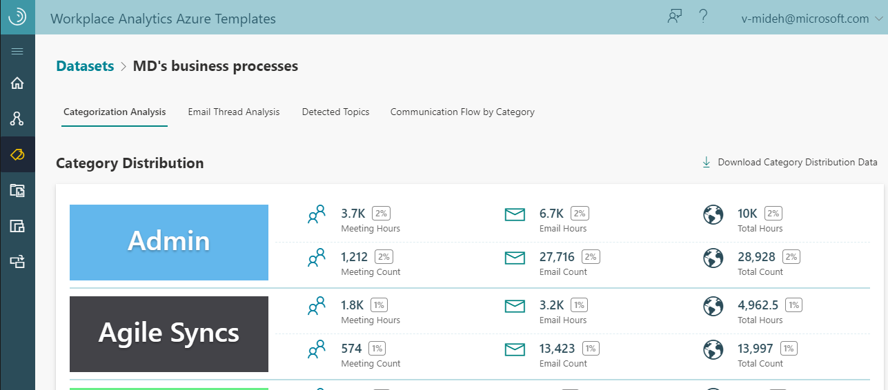
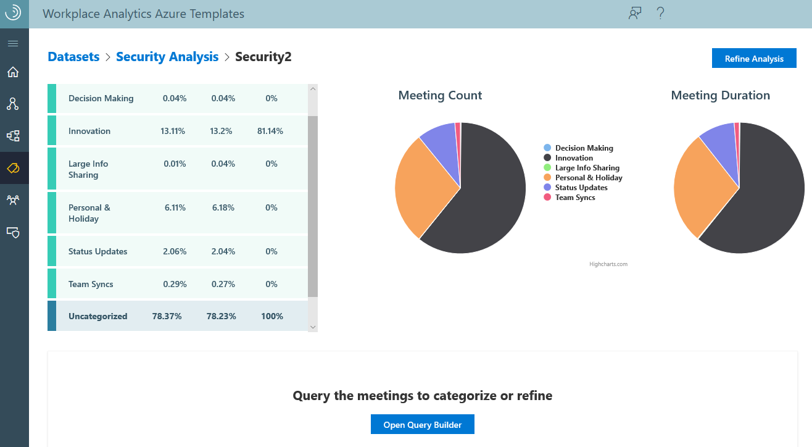
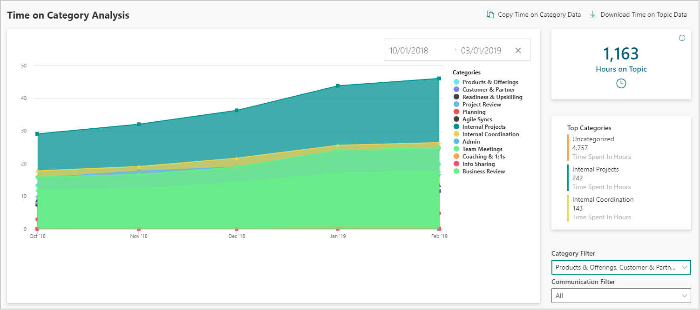
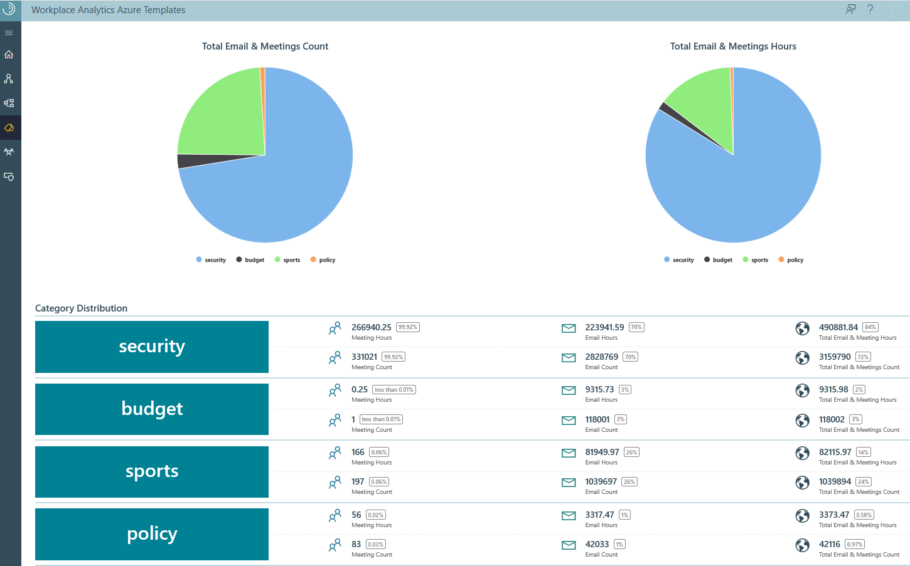
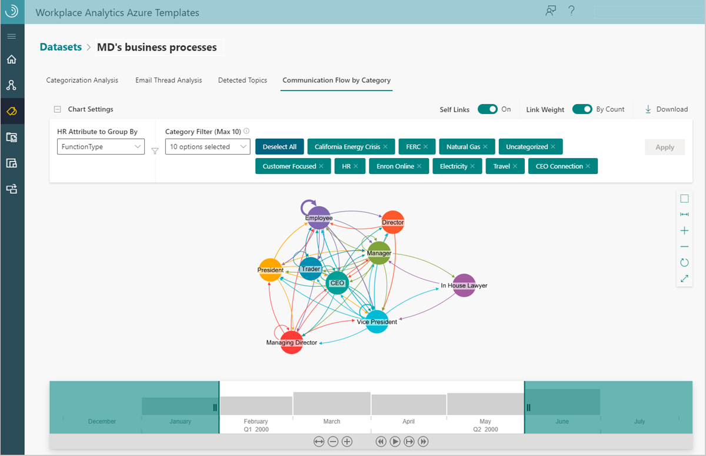

---

ROBOTS: NOINDEX,NOFOLLOW
title: Process Explorer Azure Template for Workplace Analytics 
description: Learn about the Process Explorer Azure Template for Workplace Analytics and how to use it
author: madehmer
ms.author: v-mideh
ms.topic: article
localization_priority: normal 
search.appverid: 
- MET150
ms.prod: wpa
ms.collection: M365-analytics
manager: scott.ruble
audience: Admin
---

# Process Explorer Azure Template for Workplace Analytics

_These templates are only available as part of a Microsoft service engagement._

Workplace Analytics Azure Templates includes the Process Explorer template that helps you understand where your organization and teams are investing or expending their valuable time.

You can use Process Explorer to categorize and analyze processes, projects, meetings, and other activities within a blob (cloud) storage location.

You can use a starter template or a topic detection option to produce analysis. Starter templates include predefined factory and user-defined templates, comprised of categories and associated key phrases.

You can start with a factory template, which was created by data scientists to automatically categorize data into the most common data subjects. You can view and copy the factory starter templates, but you cannot directly edit or delete them.

By copying a factory template to the user-defined library, you can customize it by adding or removing categories and associated key phrases. Or you can create your own user-defined starter template based on your specific organizational data. All starter templates are saved in the **Starter Template Library**, which are then available to use when building new analysis.

The following is available after the data is categorized using a starter template.

* **Categorization Analysis** - You can see how the activity data is distributed into predefined categories, including total number of meetings, meeting hours, email, and email hours by category. See [Categorization analysis](#categorization-analysis) for details.

* **Email Thread Analysis** - Shows static summary information about email activity for the selected dataset. See [Email thread analysis](#email-thread-analysis) for details.

* **Detected Topics** - Automatically detects topics and groups them into categories that you can copy over to your own starter template, and customize as needed. See [Detected topics](#detected-topics) for details.

* **Communication Flow by Category** - If the analysis includes an organizational network graph, this page will show you how specific categories are communicated across and within the various groups of an organization. See [Communication flow by category](#communication-flow-by-category) for details.

## To add new analysis

Use the following steps to add new analysis in Process Explorer.

1. In Workplace Analytics Azure Templates, select **Process Explorer**.
2. Select **Add New Analysis** (top right).
3. In **Define Analysis Settings**, select one of the following:

   * **Starter Template** - Choose and then select a predefined factory or a user-defined starter template in **Select a categorization Starter template**.
   * **Topic Detection only** - This option auto-detects topics in the selected dataset and then shows you the top results on the **Detected Topics** page. You can choose to export any relevant topics to a new starter template and customize the categories and key phrases by selecting **Create Starter Template**. With this option, all emails and meetings remain uncategorized on the Categorization Analysis, Email Thread Analysis, and Communication Flow by Category pages.

    

4. In **Analysis Name**, enter a unique name for this analysis.
5. Select the applicable path for the dataset to use in this analysis.
6. Select the time range to analyze.
7. In **Select the Grouping Attributes**, select two to five attributes to group the analysis.
8. In **Apply Filters**, you can optionally select any applicable filters to reduce and focus the dataset for analysis.
9. Then do one of the following:

    * **No organizational network graph** - For no graph, leave the default set to **No**, and select **Submit**. Then skip to **Step 11**.
    * **Generate Organizational Network Graph** - Change the setting to **Yes** to include **Communication Flow by Category** in the analysis, and then select **Next**.

    >[!Important]
    >With the default **No** setting, **Communication Flow by Category** will not show or be available with this analysis.

10. In **Specify the Interaction Types and Thresholds** for **Organizational Network Graph Settings**, select the following.

    * **Choose the interaction type(s)** - Select what to analyze in the dataset, independently or all emails and meetings.
    * **Maximum number of people involved in each interaction** - Select the maximum number of people involved in each interaction.
    * **Maximum duration of a meeting or call** - Select the maximum number of hours of the meeting.
    * **Advanced Settings** - Select to turn it **On** if you want to specify thresholds for interactions, such as a minimum number of emails, meetings, and interactions across both types.

11. Data analysis creation takes a few minutes to complete depending on the size of the dataset. The name will show in the **Analysis** table with the following details and available actions.

    * When the **Status** changes to a green check mark, you can select the analysis to view it.
    * **Model Type** shows if based on a starter template or topic detection only.
    * Select the **Parameters** icon to view the parameter details for a listed dataset.
    * **Source** shows the dataset the analysis is based on.
    * Select the **Job Details** (i) icon next to **Status** to view the job details.
    * Select a table column heading, such as **Name** or **Submitted**, to sort the list by.
    * Select the **Delete Dataset** (trashcan) icon to delete analysis that you created from the list.
    * If the dataset fails with a **Status** of a red X, you can select the **Undo** icon to revert to the last successfully saved version of the dataset.

     

## Categorization analysis

You can see how the activity data is distributed into predefined categories, including total number of meetings, meeting hours, email, and email hours by category. You can also select **Download Category Distribution Data** to download a .csv file of this categorized data activity.

This same data is visually presented in pie charts in the **Category Distribution Charts** section on this page. Select **Uncategorized** or any other category name to hide it from the chart view.

  

The following is available for the **Time on Category Analysis** chart at the end of this page:

* **Hours on Topic** - Shows the total number of hours spent based on the filters selected for the chart data, including the selected categories and communication types (all, email, or meeting activity) that have been categorized for the dataset for the selected period of time.
* **Category Filter** - Select one or more categories to focus the chart on. The default is **All**, which shows all categories available in the dataset.
* **Communication Filter** - Select to filter the chart to view only email or meeting activity. The default is **All**, which shows all email and meeting activity that was categorized in the dataset.
* **Date filter** - You can select a Start Date and End Date for the time period of data that you want to see in the chart. The default is **All**, which shows all time periods available in the dataset.

 

You can also select **Copy Time on Category Data** or **Download Time on Topic Data** for a .csv file of the data.

## Email thread analysis

An email thread includes a sent email and all its succeeding replies. Use **Email Thread Analysis** to analyze email.

In **Process Explorer**, select a data analysis name, and then select **Email Thread Analysis**.

You can see static summary information, including top level analysis, thread averages, and thread metrics for the first 1,000 threads in the selected dataset. In the **Thread Data** section, you can do the following.

* Select **Download** to view data for either the **Thread Summary** or **Thread Details** in a .csv file for all email threads in the dataset.
* Select **Copy Data** to copy a table view of either the **Thread Summary** or **Thread Details** data.

 

   |Thread metric |Description |
   |--------------|-------------|
   |Threads originated |Distinct number of email thread IDs.|
   |Total emails sent |Total number of sent emails.|
   |Distinct touchpoints |Number of participants across all threads multiplied by the number of emails in the thread. |
   |Hours of email workload |Total number of hours spent on email threads.|
   |Average number of emails in a thread |Average number of emails sent within email threads. |
   |Participants in the typical thread |Average number of all participants in email thread, including passive participants. The average is calculated by dividing the number of participants by the number of email thread IDs.|
   |Distinct participant touchpoints |Total number of touchpoints divided by the number of email thread IDs. |
   |Participation workload generated |Number of email hours generated by all participants in the thread divided by the number of email thread IDs. |
   |Active thread contributors |Number of participants within a thread that send at least one email in the thread divided by the number of all participants. |
   |Average response time |For all forwards and replies, the average number of hours between the sent items and the previously sent items in email threads. |
   |Average lifespan of a thread |The average number of days between thread origination and the last sent item in email threads. |

## Detected topics

This template uses a natural-language processing algorithm to look at all the uncategorized meetings and emails and detect clusters of associated keywords in the dataset and categorize them for your review. **Detected topics** shows up to 50 categories that you can select to add to a new starter template. You can then select **Create Starter Template** to create a new user-defined starter template with these categories.

  

You can then edit the category name or delete it entirely. For each category, you can change the associated key phrases to include or exclude. You can also add an **asterisk** (*) to a key word as a wild card. For example, the following graphic shows **resourc** with an asterisk in **Key phrases to include** for the **Team meetings** category. This will include any subjects that have a word or phrase that starts with **resourc**, such as resources, resourcing, or resource group in the associated category.

  

After you create a new starter template, you can then use it when creating new analysis.

## Communication flow by category

If you selected to include an organizational network graph when adding new analysis, your analysis will include Communication flow by category. This page shows how specific categories are communicated across and within the various groups of an organization for varying time periods with the following functionality.

* **HR Attribute to Group By** - Use to specify how to group individuals who are communicating.
* **Category Filter** - Use to specify which categories of communication you want to focus on.
* **Self Links** - Turn it on to see how a group communicated with itself on the specified categories.
* **Link Weight by Hours** or **by Count** - Select an option for how you want to see the communication flow and the links will scale accordingly. Link weight is per person for the selected time period, such as hours per person.
* **Graph tools** - Use the tools to the right of the graph to move and adjust graph elements, fit chart to view, zoom in and out, run the layout, and switch between a full screen and window view.
* **Time Bar** - Adjust the bar to show how the communication flows over the selected time period. For example, double click a month in the time bar to select only that month to view in the graph.
* **Play an animation** - Use the **play**, **pause**, and **skip** buttons at the bottom of the time bar to show an animation of how the communication flow evolves for the selected time period. For example, select the **play** button to watch how communication changes in the groups shown in the graph over time.

* **Download** - Use to download a .csv file of the communication flow data.

## Related topics

* [Workplace Analytics Azure Templates overview](./overview.md)
* [What's new in Workplace Analytics Azure Templates](./release-notes.md)
* [Deploy and configure Workplace Analytics Azure Templates](./deploy-configure.md)
