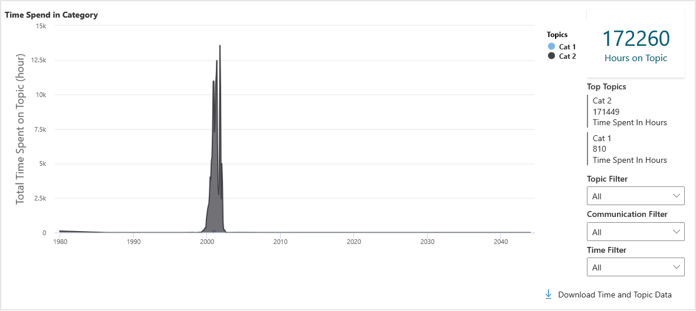
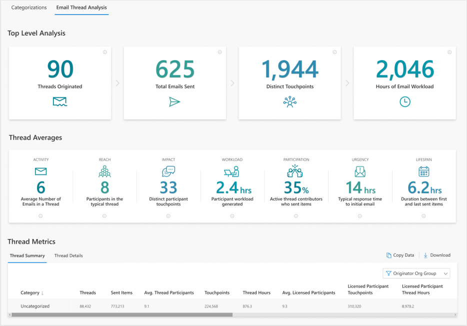

---

ROBOTS: NOINDEX,NOFOLLOW
title: Process Explorer Azure Template for Workplace Analytics 
description: Learn about the Process Explorer Azure Template for Workplace Analytics and how to use it
author: madehmer
ms.author: v-midehm
ms.topic: article
localization_priority: normal 
ms.prod: wpa
ms.collection: M365-analytics
manager: scott.ruble
audience: Admin
---

# Process Explorer Azure Template for Workplace Analytics

_These templates are only available as part of a Microsoft service engagement._

Workplace Analytics Azure Templates includes the Process Explorer template that helps you understand where your organization or team is investing or expending valuable time.

You can use Process Explorer to categorize processes, projects, meetings, and other activities. You can connect to a blob (cloud) storage location to analyze meeting and email activity.

After you upload a dataset, you can use the Query Builder to help you decide what categories to add for analysis. You can select category names or phrases from the word cloud to view those meetings and then categorize them in the dashboard view.

After you categorize a good sample of meetings into the specified categories:

* You can view meeting data based on those categories with visual charts and lists.
* The categorization options depend on what the template's admin settings are for email activity:
  
  * If email categorization is enabled, you'll use both the Meeting and Email category pages to manually categorize meeting and email activity separately, which better trains the model for auto-categorizing the full dataset.
  * If no Email category page is shown, you'll only see and use the Meeting category page to manually categorize meetings, which creates distinct models for the two types of content and more accurate overall results.

* You can also use the **Refine Categorization** option to create a copy of the selected analysis and add or change the categories for more in-depth analyses.

You can also skip categorization and use the **Email Thread Analysis** page to get static summary information about email activity for a specific dataset. See [Email thread analysis](#email-thread-analysis) for more details.

## To add a new dataset

Use the following steps to add a blob storage dataset for analyzing meeting and email data.

1. In Workplace Analytics Azure Templates, select **Process Explorer**.
2. Select **Add New Dataset** (top right).
3. In **Define Model Training Settings**, enter a dataset name, locate and select the path to the dataset, and select the time range to analyze. You can then optionally select any applicable filters to reduce the dataset to use to manually categorize for model training purposes, and then select **Submit**.
4. The dataset upload and initial model training takes a few minutes to complete depending on the size of the dataset. The name and source for the new dataset will show in the table with the following information and available actions.

   * When the **Status** changes to a green check mark, you can select the dataset to view it for categorizations or analysis.
   * Select the **Job Details** (i) icon next to **Status** to view the job details.
   * Select a table column heading, such as **Name** or **Submitted**, to sort the list by.
   * Select the **Parameters** icon to view the parameter details for a listed dataset.
   * Select the **Delete Dataset** (trashcan) icon to delete it from the list.
   * If the dataset fails with a **Status** of a red X, you can select the **Undo** icon to revert to the last successfully saved version of the dataset.

## To categorize meetings for analysis

Use the following steps to manually categorize meetings.

1. On the **Process Explorer** page, select the dataset name from the list.
2. What you do next depends on the dataset.

   * **For new datasets**, you're prompted to enter:
      * **Categorization Title** - Each dataset requires at least one category for analysis, which is how you want to categorize the meetings.
      * **Probability Threshold** - The threshold option is how likely a meeting must be in a category before it's automatically assigned to that category.
      * **Create a new categorization model or use a saved model** - The model option saves you time by using an existing training model that you saved while categorizing similar data with the query builder. Or you can reuse the same model on the same dataset to analyze historical data trends for different date ranges.

   * **For existing datasets**, you can select:

     * **Add New Categorization** and then enter a title, a probability threshold, and then select to either create a new model or use a saved model, same as with new datasets.
     * The name of an *existing draft categorization* to resume work on it.
     * Select the row with the name of an *existing categorization*, and then select **Add New Categorization** to make a copy of it to work from.

3. Each dataset requires at least one category for analysis, which is how you want to categorize the meetings. In **Dashboard** > **Add a New Category**, enter the name of a category you want to add, and then press **Enter** to add it to the list.
4. Select **Meeting** > **Open Query Builder** > **Discover Topics**, enter one or more keywords, separated by commas, in one of the applicable **Keyword** boxes to view meetings with these keywords, and then select **Run query**. You can also select a word from the word cloud to add it as a keyword.

   

   * To search for word phrases, separate the phrase with an underline (for example **budget_manager**).
   * To search for word phrases in any order, separate the words with spaces (for example **budget finance manager**).
   * Use **Keywords OR** to include titles with words that contain any of the words entered or any combination of these words (phrases separated with spaces).
   * Use **Keywords NOT** to exclude titles with these words from the search and data analysis.
   * **Max Meetings to Show** to set the maximum number of meetings to include in the list or show in the word cloud.

5. In **Meeting** > **Open Query Builder** > **Filter Dataset**, you can filter the meetings shown in the list with the following options, and then select **Run Query**.

   * **Filter by Sources** to select the analyst and/or the model to filter the meetings by, which are those meetings that were categorized manually by the analyst or those categorized automatically by the model.
   * **Filter by Categories** to select one or more categories to filter the meetings by, such as budget, as shown in the following graphic.
   * **Probability Range** to adjust the minimum and maximum probability range to filter the word cloud and meeting list to include.
   * **Max Results to Show** to set how many results to show in the list.
   * **Which Meetings do you want to include in your query results?** You can select specific meetings to include or exclude from the data to categorize. For example, you could exclude meetings where the organizer is outside the filter population. Or you could only include meetings equal to or greater than one hour in the list.

   

6. After the data is queried, close the query builder pane to see the meeting list, and then to help train the model for auto-categorization of the whole dataset:

   * Select a category, select all meetings in the list by selecting the check box next to **Subject**, and then select **Apply** to add these meetings to that category.
   * Or select a category, individually select the check box next to a good sample of related meetings, and then select **Apply** to add them to that category.

    

   * In **Dashboard** > **Add a New Category**, enter any additional categories needed for grouping the uncategorized meetings.
   * Hover the cursor over an existing category and select the **Rename Category** (pencil) icon to rename it or the **Delete Category** (trashcan) icon to delete it from the list.
   * After you categorize a good sample of related meetings for all the categories you want to evaluate:

     * Below the table on the Dashboard, select **Save Categorization Model** to save this categorization training model to reuse later. And then when creating a new dataset, or a subgroup of this dataset, you can use this same categorization training model to save time. For example, you can use the same model on the same dataset to analyze historical data trends for different data ranges.
     * For .csv datasets, select **Auto-Categorize Full Dataset** to categorize all of the meetings uploaded in the .csv file.
     * For blob storage datasets, select **Auto-Categorize Meetings**, and then see [Step 3 in To categorize email activity for analysis](#to-categorize-email-activity-for-analysis) for next steps to categorize email.

       

7. To add or change categories for a categorization, such as to focus on a subset of the data, select **Refine Categorization** to create a copy of the selected analysis, and then repeat these steps to add new or change existing categories.

> [!Note]
>Use the Download option (bottom right) to download a .csv of the data shown in the dashboard table.

## Email activity analysis

You can get more complete analysis based on email activity related to the selected process categories.

Ask your admin what is set for surfacing and classifying email activity for analysis. The admin can go to **Admin** > **Configuration** > **Process Explorer** and confirm which is selected:

  

For email categorization, the system will limit the data used for categorizations to five million emails and meetings to improve interactivity. If you know the subset of data you want to focus on, you can set time range and/or filters to focus the data used.  If not, or if your filtering still results in more than five million values, the system will automatically choose a good representative sample from the complete filtered sample.

The email categorization option depends of what the admin settings are for email activity:
  
* If email categorization is enabled, you'll use both the Meeting and Email category pages to manually categorize meeting and email activity separately, which better trains the model for auto-categorizing the full dataset.
* If no Email category page is shown, you'll only see and use the Meeting category page to manually categorize meetings, which trains the model for auto-categorizing the full dataset, including both meeting and email activity.

### To categorize email activity for analysis

1. If you haven't done so already, follow the steps to [add a new dataset](#to-add-a-new-dataset).
2. If you haven't done so already, complete the steps [to categorize meetings](#to-categorize-meetings-for-analysis) for the new dataset.
3. If no **Email** category page is shown, you can select **Auto-Categorize Full Dataset** and the template will automatically assign a category to all meetings and email in the whole dataset based on the sample meeting categorizations; this will take a few minutes or more depending on the size of the dataset.

4. If the **Email** category page is available, then you can manually manually categorize email activity by selecting **Email** > **Query Builder** and then entering one or more keywords, separated by commas, in one of the applicable **Keyword** boxes to view email with these keywords, and then select **Run query**.

   * To search for word phrases, separate the phrase with an underline (for example **budget_manager**).
   * To search for word phrases in any order, separate the words with spaces (for example **budget finance manager**).
   * Use **Keywords OR** to include titles with words that contain any of the words entered or any combination of these words (phrases separated with spaces).
   * Use **Keywords NOT** to exclude titles with these words from the search and data analysis.
   * **Max Results to Show** to set the maximum number of email to include in the list or show in the word cloud.
   * **Which Emails do you want to include in your query results?** You can filter the email to include in or exclude from the data list to categorize. For example, you could include only email that the sender spent 10 minutes or more on.

   

5. In **Email** > **Open Query Builder** > **Filter Dataset**, you can filter the email shown in the list with the following options, and then select **Run Query**.

   * **Filter by Sources** to select the analyst and/or the model to filter the email by, which are those meetings that were categorized manually by the analyst or those categorized automatically by the model.
   * **Filter by Categories** to select one or more categories to filter the email by, such as budget, as shown in the following graphic.
   * **Probability Range** to adjust the minimum and maximum probability range to filter the word cloud and email list to include.
   * **Max Results to Show** to set how many results to show in the list.

6. After email is auto-categorized, go to **Email** > **Query Builder** > **Filter Dataset** to show those categorized by the model and confirm that you agree with the model categorizations in all the categories.

7. After confirming the model categorizations:

   * Below the table on the Dashboard, select **Save Categorization Model** to save this categorization training model to reuse later. And then when creating a new dataset, or a subgroup of this dataset, you can use this same categorization training model to save time. For example, you can use the same model on the same dataset to analyze historical data trends for different date ranges.
   * Select **Auto-Categorize Full Dataset** and the template will automatically assign a category to all meetings and email in the whole dataset based on the sample categorizations; this will take some time based on the size of the dataset.

8. To add or change categories for your analysis, such as to focus on a subset of the data, select **Refine Categorization** to create a copy of the selected analysis and then repeat the previous steps [to categorize meetings for analysis](#to-categorize-meetings-for-analysis) and then repeat these steps to categorize email.

You can see data about the categorized email and meetings on the dashboard. Also, you can select **Download** to save a .csv snapshot of the current data shown on the **Dashboard** page.

  

After the full dataset is categorized, you can view time spent on specific categories in the **Time Spent on Category** section below the **Category Distribution** section. The following is available with the chart:

* **Hours on Topic** - Shows the total number of hours spent based on the filters selected for the chart data, including the selected topics (categories) and communication types (all, email, or meeting activity) that have been categorized for the dataset for the selected period of time.
* **Topic Filter** - Select a specific topic to focus the chart on. The default is **All**, which shows all categories available in the dataset.
* **Communication Filter** - Select to filter the chart to view only email or meeting activity. The default is **All**, which shows all email and meeting activity that was categorized in the dataset.
* **Time Filter** - Select what period of time you want to see chart data for, such as last month, last quarter, last six months, or last year. The default is **All**, which shows all time periods available in the dataset.

  

## Email thread analysis

You can skip categorization and focus on automated email analysis. An email thread includes a sent email and all its succeeding replies. Use **Email Thread Analysis** to analyze email for a dataset that's filtered for a specific time period and for a specific group within a dataset. The time ranges and filter options are the same as what's available for categorization analysis.

### To view analysis for email threads

1. On the **Process Explorer** page, select **Add New Dataset**.
2. For **Select Dataset Type**, select to **Classify on raw data** to use all meeting and email data from the blob storage location, and then select **Next**.
3. Enter a dataset name, locate and select the path to the dataset, and select the time range to analyze. You can then optionally select any applicable filters to reduce the dataset, and then select **Submit**.

   

4. The dataset upload takes a few minutes to complete depending on the size of the dataset. The name and source for the new dataset will show in the table.
5. When the **Status** changes to a green check mark, select the dataset name from the list, and then select **Email Thread Analysis**.
6. You'll see static summary information, including top level analysis, thread averages, and thread metrics for the first 1,000 threads in the selected dataset. In the **Thread Metrics** section, you can do the following.

   * Select **Download** to view data on what's selected, which is either the **Thread Summary** or **Thread Details**, in a .csv file for all email threads in the dataset.
   * Select **Copy Data** to copy a table view of the **Thread Summary** data. This option is not available for thread details.

   

   |Thread metric |Description |
   |--------------|-------------|
   |Threads originated |Distinct number of email thread IDs.|
   |Total emails sent |Total number of sent emails.|
   |Touchpoints |Number of participants across all threads multiplied by the number of emails in the thread. |
   |Hours of email workload |Total number of hours spent on email threads.|
   |Average number of emails in a thread |Average number of emails sent within email threads. |
   |Participants in the typical thread |Average number of all participants in email thread, including passive participants. The average is calculated by dividing the number of participants by the number of email thread IDs.|
   |Distinct participant touchpoints |Total number of touchpoints divided by the number of email thread IDs. |
   |Participation workload generated |Number of email hours generated by all participants in the thread divided by the number of email thread IDs. |
   |Active thread contributors |Number of participants within a thread that send at least one email in the thread divided by the number of all participants. |
   |Average response time |For all forwards and replies, the average number of hours between the sent items and the perviously sent items in email threads. |
   |Average lifespan of a thread |The average number of days between thread origination and the last sent item in email threads. |

## Related topics

* [Workplace Analytics Azure Templates overview](./overview.md)
* [What's new in Workplace Analytics Azure Templates](./release-notes.md)
* [Deploy and configure Workplace Analytics Azure Templates](./deploy-configure.md)
