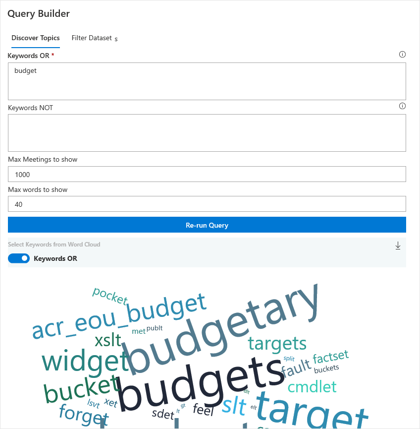
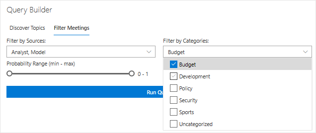
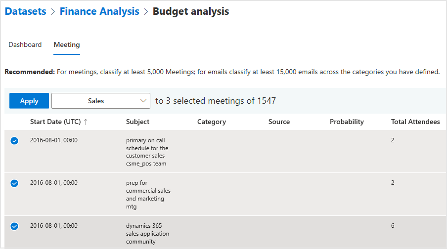
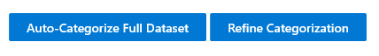

---
# Metadata Sample
# required metadata

ROBOTS: NOINDEX,NOFOLLOW
title: Process Explorer Azure Template for Workplace Analytics 
description: Learn about the Process Explorer Azure Template for Workplace Analytics and how to use it
author: madehmer
ms.author: v-midehm
ms.topic: article
localization_priority: normal 
ms.prod: wpa
ms.collection: M365-analytics
manager: scott.ruble
audience: Admin
---

# Process Explorer Azure Template for Workplace Analytics

_These templates are only available as part of a Microsoft service engagement._

Workplace Analytics Azure Templates includes the Process Explorer template that helps you understand where your organization or team is investing or expending valuable time.

You can use Process Explorer to categorize processes, projects, meetings, and other activities. You can either upload a .csv dataset to analyze meeting activity or connect to a blob (cloud) storage location to analyze meeting and email activity.

After you upload a dataset, you can use the Query Builder to help you decide what categories to add for analysis with the word cloud. You can select category names or phrases from the word cloud to view those meetings and then categorize them.

After you categorize a good sample of meetings into the specified categories, you can:

* View meeting data based on those categories with visual charts and lists.
* For a .csv dataset, select to **Auto-Categorize Full Dataset** based on the sample meeting categorizations already done by you, as the analyst.
* For a blob storage dataset, categorize email activity for more complete analysis.
* Use the **Refine Categorization** option to create a copy of the selected analysis and add or change the categories for more in-depth analysis.

## To add a new dataset

1. In Workplace Analytics Azure Templates, select **Process Explorer**.
2. Select **Add New Dataset** (top right).
3. For **Select Dataset Type**, select either to upload meeting query output to analyze or classify raw meeting and email data, and then select **Next**.

   

4. Enter a dataset name, locate and select the .csv file or path to the blob storage dataset, and then select **Upload Dataset** (.csv) or **Run** (blob storage).
5. When prompted, select **OK**. The upload will take a few minutes to complete.
6. Your new dataset's name and source are listed in the table with the following information and available actions.

   * When the **Status** changes to a green check mark, you can select a dataset to view existing categorizations or add a new categorization to analyze.
   * Select the **Job Details** (i) icon next to **Status** to view the job details.
   * Select a table column heading, such as **Name** or **Submitted**, to sort by it.
   * Select the **Parameters** icon to view the parameter details for a listed dataset.
   * Select the **Delete Dataset** (trashcan) icon to delete it from the list.
   * If the dataset fails with a **Status** of a red X, you can select the **Undo** icon to revert to the last successfully saved version of the dataset.

## To categorize meetings for analysis

1. On the **Process Explorer** page, select the dataset name from the list.
2. What you do next depends on the dataset.

   * **For new datasets**, you're prompted to enter a categorization title and the probability threshold for the categorization. The threshold option is how likely a meeting must be in a category before it's automatically assigned to that category. Each dataset requires at least one category for analysis, which is how you want to categorize the meetings.
   * **For existing datasets**, you can select:

     * **Add New Categorization** and then enter a title and probability threshold, same as with new datasets.
     * The name of an *existing draft categorization* to resume work on it.
     * Select the row with the name of an *existing categorization*, and then select **Add New Categorization** to make a copy of it to work from.

3. Each dataset requires at least one category for analysis, which is how you want to categorize the meetings. In **Dashboard** > **Add a New Category**, enter the name of a category you want to add, and then press **Enter** to add it to the list.
4. Select **Meeting** > **Open Query Builder** > **Discover Topics**, enter one or more keywords, separated by commas, in one of the applicable **Keyword** boxes to view meetings with these keywords, and then select **Run query**. You can also select a word from the word cloud to add it as a keyword.

     

   * To search for word phrases, separate the phrase with an underline (for example **budget_manager**).
   * To search for word phrases in any order, separate the words with spaces (for example **budget finance manager**).
   * Use **Keywords OR** to include titles with words that contain any of the words entered or any combination of these words (phrases separated with spaces).
   * Use **Keywords NOT** to exclude titles with these words from the search and data analysis.
   * **Max Meetings to Show** to set the maximum number of meetings to include in the list or show in the word cloud.

5. In **Meeting** > **Open Query Builder** > **Filter Dataset**, you can filter the meetings shown in the list with the following options, and then select **Run Query**.

   * **Filter by Sources** to select the analyst and/or the model to filter the meetings by, which are those meetings that were categorized manually by the analyst or those categorized automatically by the model.
   * **Filter by Categories** to select one or more categories to filter the meetings by, such as budget, as shown in the following graphic.
   * **Probability Range** to adjust the minimum and maximum probability range to filter the word cloud and meeting list to include.
   * **Max Results to Show** to set how many results to show in the list.

     

6. After the data is queried, close the query builder pane to see the meeting list, and then to help train the model for auto-categorization of the whole dataset:

   * Select a category, select all meetings in the list by selecting the check box next to **Subject**, and then select **Apply** to add these meetings to that category.
   * Or select a category, individually select the check box next to a good sample of related meetings, and then select **Apply** to add them to that category.

      

   * In **Dashboard** > **Add a New Category**, enter any additional categories needed for grouping the uncategorized meetings.
   * Hover the cursor over an existing category and select the **Rename Category** (pencil) icon to rename it or the **Delete Category** (trashcan) icon to delete it from the list.
   * After you categorize a good sample of related meetings for all the categories you want to evaluate:

     * For .csv datasets, select **Auto-Categorize Full Dataset** to categorize all of the meetings uploaded in the .csv file.
     * For blob storage datasets, select **Auto-Categorize Meetings**, and then see [Step 3 of To categorize email for analysis](#to-categorize-email-for-analysis) for next steps to categorize email.

     

7. To add or change categories for a categorization, such as to focus on a subset of the data, select **Refine Categorization** to create a copy of the selected analysis, and then repeat these steps to add new or change existing categories.

## Meeting and email activity analysis

By using blob storage as the data source, you can get more complete analysis based on all meeting and email activity related to the selected process categories. You have two choices for automatically categorizing a blob storage dataset for analysis:

* Include and manually categorize a sampling of only meeting activity to help train the template model.
* Or you can manually categorize both meeting and email activity to help train the template model for automatically categorizing the full dataset.

Complete the following steps to manually categorize both meeting and email activity for a blob storage dataset.

### To manually categorize email activity for analysis

1. If you haven't done so already, follow the steps to [add the blob storage dataset](#to-add-a-new-dataset).
2. If you haven't done so already, complete the steps [to categorize meetings](#to-categorize-meetings-for-analysis) for the blob storage dataset and in **Step 6**, select to **Auto-Categorize Meetings** for your blob storage dataset. This option will randomly select a sample of 10,000 meetings to auto-categorize.
3. After meetings are auto-categorized, you can do one of the following:

   * Continue to the next step to manually categorize a sample of email activity with the Query Builder.
   * Select **Auto-Categorize Full Dataset** and the template will automatically assign a category to all meetings and email in the whole dataset based on the sample meeting categorizations; this might take some time based on the size of the dataset.

4. To manually categorize email activity, open **Email** > **Query Builder** and then enter one or more keywords, separated by commas, in one of the applicable **Keyword** boxes to view email with these keywords, and then select **Run query**.

     * To search for word phrases, separate the phrase with an underline (for example **budget_manager**).
     * To search for word phrases in any order, separate the words with spaces (for example **budget finance manager**).
     * Use **Keywords OR** to include titles with words that contain any of the words entered or any combination of these words (phrases separated with spaces).
     * Use **Keywords NOT** to exclude titles with these words from the search and data analysis.
     * **Max Email to Show** to set the maximum number of email to include in the list or show in the word cloud.

       

5. In **Email** > **Open Query Builder** > **Filter Dataset**, you can filter the email shown in the list with the following options, and then select **Run Query**.

   * **Filter by Sources** to select the analyst and/or the model to filter the email by, which are those meetings that were categorized manually by the analyst or those categorized automatically by the model.
   * **Filter by Categories** to select one or more categories to filter the email by, such as budget, as shown in the following graphic.
   * **Probability Range** to adjust the minimum and maximum probability range to filter the word cloud and email list to include.
   * **Max Results to Show** to set how many results to show in the list.

6. After email is auto-categorized, go to **Email** > **Query Builder** > **Filter Dataset** to show those categorized by the model and confirm that you agree with the model categorizations in all the categories.
7. After confirming the model categorizations, select **Auto-Categorize Full Dataset** and the template will automatically assign a category to all meetings and email in the whole dataset based on the sample categorizations; this might take some time based on the size of the dataset.
8. To add or change categories for your analysis, such as to focus on a subset of the data, select **Refine Categorization** to create a copy of the selected analysis and then repeat the previous steps [to categorize meetings for analysis](#to-categorize-meetings-for-analysis) and these steps to categorize email.

You can see data about the categorized email and meetings on the dashboard. Also, you can select **Download** to save a .csv snapshot of the current category table information.

   

## Related topics

* [Workplace Analytics Azure Templates overview](./overview.md)
* [What's new in Workplace Analytics Azure Templates](./release-notes.md)
* [Deploy and configure Workplace Analytics Azure Templates](./deploy-configure.md)
