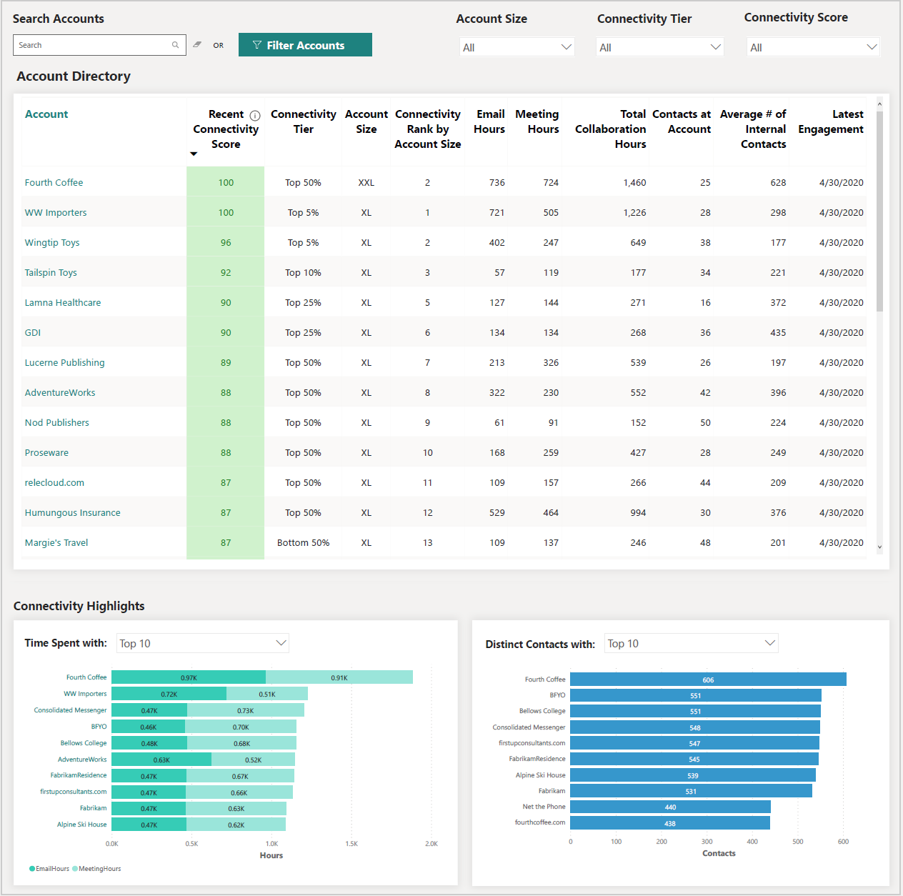
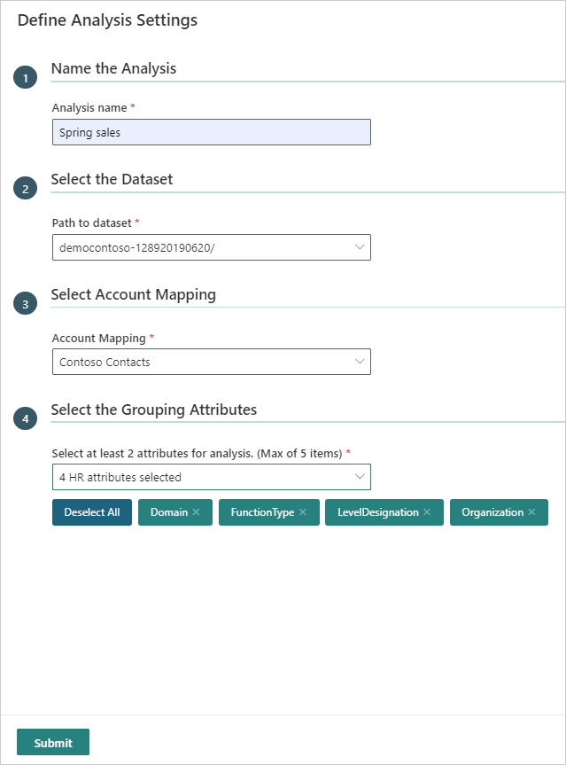
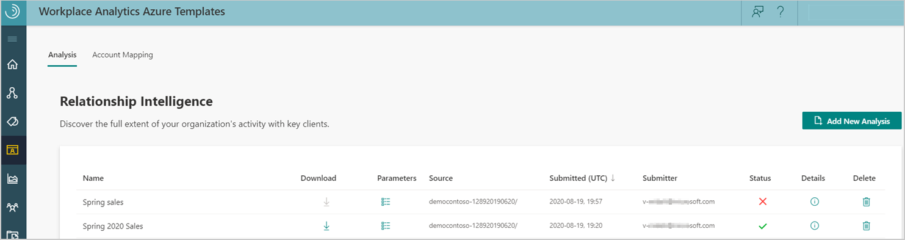
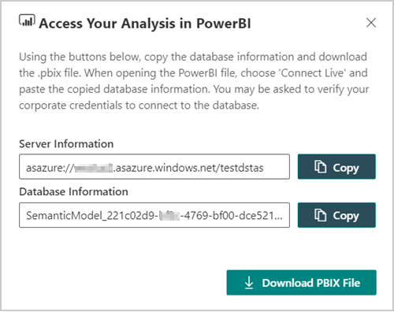
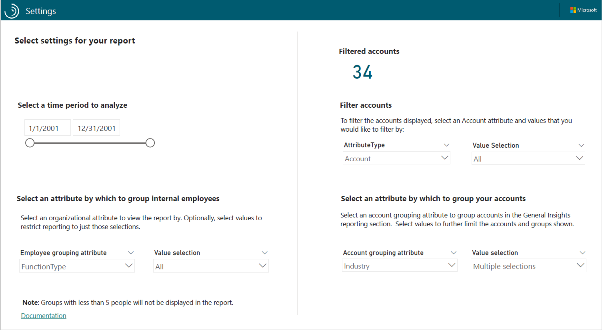
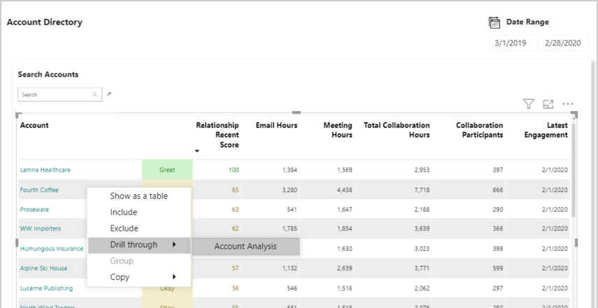
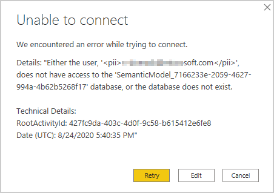

---

ROBOTS: NOINDEX,NOFOLLOW
title: Relationship Intelligence report 
description: Learn about the Relationship Intelligence Power BI report included in Workplace Analytics Azure Templates and how to use it
author: madehmer
ms.author: v-mideh
ms.topic: article
localization_priority: normal 
search.appverid: 
- MET150
ms.prod: wpa
ms.collection: M365-analytics
manager: scott.ruble
audience: Admin
---

# Relationship Intelligence

_These templates are only available as part of a Microsoft service engagement._

Workplace Analytics Azure Templates includes the Relationship Intelligence report for Power BI. You can use this report to analyze relationships your organization has with collaborators external to the company, such as relationships with customers or partners.

Workplace Analytics has a variety of measures to help you visualize and analyze formal and informal relationships within your organization. This report can help you understand how internal groups are communicating and spending their time with ***external*** collaborators.

This report uses account and contact information from a Customer Relationship Management (CRM) platform, such as Dynamics or Salesforce. The CRM data provides account-level focus and insights into relationship patterns. If no account or contact data is available, it analyzes external domain-level collaboration as a proxy for accounts.

The Relationship Intelligence report includes the following.

* **Relationship Overview** - Shows information about all accounts, including:

  * The Account table shows an overview of related collaboration activity with accounts, such as email and meeting hours spent with them and the last date the organization engaged with them.
  * The **Connectivity Score** is based on the amount, frequency, and timeliness of collaboration activity with an account.
  * Page down to see **Relationship Highlights** > **Total Time Spent** chart and a chart with **Distinct contacts** analysis.
  * Use the **Internal Group Settings** on the Settings page to focus the chart analysis (below the filter) to specific internal groups who are collaborating. The **Group Engagement** and **Collaboration Time** charts show more details about overall account collaboration activity.

* **Account Analysis** - Focuses in on the following details about an account that you selected and drilled through from the first page:

  * See visuals about the average **Connectivity Score** and how the score has changed over the selected time and how metrics contributing to the score have changed over the same time period.
  * Examine the collaboration visuals on this page to see what type of communication has occurred with contacts over time and who the top individual account contacts are that the organization has collaborated with. The second table lists the top internal groups in the organization who have collaborated with an account based on the Internal Group Settings values from the Settings page.
  * Investigate the **Topics** section to see the main topics in a word cloud that indicate what collaboration activity was focused on for the selected account. The topics are based on the subject lines for meetings and email. Use the **Time Range Selection** to see how the topics in the word cloud change based on what date range is selected.
  * You'll also see visuals for collaboration trends by communication type for the selected account over the selected time period.

* **Individual Collaborators** - Shows more details about all the individual account contacts and all the organizational groups that have collaborated with these contacts. The tables include the Connectivity Score and other details about how your organization is collaborating with individual account contacts for the selected account.
* **External Collaborators** - Shows more details about the external collaborator that you selected from the Individual Collaborators page. It shows details about a person outside the organization that collaborated with one or more of the organizational groups. It focuses on details, such as their most recent Connectivity Score, Influencer rank (how connected an individual is at the external company), group engagement, and collaboration time.
* **Domain Details** - Shows details about any individuals included in the data that missing or incorrect CRM or account data.

## Steps to create the report

1. [Prerequisites](#prerequisites) - Confirm or complete all the prerequisites.
2. [Add an account mapping](deploy-configure.md#account-mapping) - Follow the steps to create a new account mapping file for Workplace Analytics Azure Templates.
3. [Add new analysis](#add-new-analysis) - Follow the steps to create the dataset in Workplace Analytics Azure Templates that the Power BI report uses.
4. [Load the data and view the report](#load-the-data-and-view-the-report) - Follow the steps to download the Power BI template and load the data in Power BI. You can then use Power BI to visualize the data and drill in and focus on account details.

## Prerequisites

* **CRM data** –  Accounts and contacts exported as .csv files from your CRM, such as Microsoft Dynamics or Salesforce. See [Required CRM file formats](deploy-configure.md#required-crm-file-formats) for details about what the files must include based on the type of CRM.
* **Data export** - The Workplace Analytics admin must include  **ExternalCollaboratorIDs** and *unhashed* **Subject lines** in the [Data export from Workplace Analytics](../Data-Access/Data-Access.md#to-export-data-from-workplace-analytics). The subject lines are required to view topic results from your organization's email and meetings in the report. If this data is unavailable, that section of the report will show no data.
* **Power BI Desktop** - Have the latest version of Power BI Desktop installed locally. If you have an earlier version of Power BI installed, uninstall it before installing the new version. Then go to [Get Power BI Desktop](https://www.microsoft.com/p/power-bi-desktop/9ntxr16hnw1t?activetab=pivot:overviewtab) to download and install the latest version.
* **Template access** - Have access to the Relationship Intelligence Azure Template, which is required for you to view the data in the Power BI report.

## Add new analysis

After you add an [account mapping file](deploy-configure.md#account-mapping) for your customer accounts and contacts, do the following to create the dataset for the report.

1. In Workplace Analytics Azure Templates, select **Relationship Intelligence** > **Add New Analysis** (at top right).
2. In **Define Analysis Settings**, enter a friendly name for the analysis and select the path to the dataset.

    

3. In **Select Account Mapping**, select the mapping file you created in [Account mapping](deploy-configure.md#account-mapping).
4. In **Select the Grouping Attributes**, select two to five HR attributes to analyze and use to pivot analysis in Power BI. These are the HR attributes imported with the organizational data from Workplace Analytics.
5. Select **Submit**. Creating the dataset will take a few minutes up to a few hours based on the size of the data.
6. In **Relationship Intelligence** > **Analysis**, the analysis table includes the name, the source, the date is was submitted, who submitted it, and the following:

   * **Download** - Select to copy a link to this dataset and download the Power BI template.
   * **Parameters** - Lists details about the job parameters, such as the input path, output folder, excluded keywords, the mapping file name, the HR attributes included, and the person who created this analysis.
   * **Status** - Analysis shows a green check mark when it successfully adds it. A red X means it failed.
   * **Details** - Lists the job details including error messages (far right column) to help troubleshoot a failure.
   * **Delete** - Select to delete analysis that failed or that's no longer needed.

    >[!Note]
    >If you delete the job, the underlying data required for the report is also deleted and any Power BI file that uses this data won’t work or show any data because it uses an OData link to the live data.

    

    

## Load the data and view the report

1. In **Workplace Analytics Azure Templates** > **Relationship Intelligence** > **Analysis**, when the analysis status has a green check mark, select the **Download** icon for the analysis.
2. You need to copy both the server and database information for this analysis when prompted in Power BI Desktop in **Step 6**.
3. Select **Download PBIX File** to download the Power BI template for the report.
4. Open the downloaded file in Power BI Desktop.
5. If prompted, sign in with your corporate credentials.
6. Do one of the following in Power BI Desktop:

   * If you get a "data unavailable" error, select **Edit**, and then paste the server and database names that you copied for the analysis in **Step 2** in the **Server** and **Database** fields, and then select **OK**.
   * If no error occurs, select **Transform data** > **Data source settings** and paste the server and database names that you copied for the analysis in **Step 2** in the **Server** and **Database** fields, and then select **OK**.

7. If prompted by the Navigator, select **Model**, and then **OK**.
8. It might take a few minutes to load the data from the database into the report. After it loads, you can analyze report data with Power BI tools and visualizations.

## Report settings

After the Relationship Intelligence Report is set up and populated with data, use the following to confirm the report settings.

* **Date Settings** - Choose to analyze a specific date range within the date range of data included in this report.
* **Settings Result** - Shows the number of accounts included in the dataset based on the selected account attribute settings.
* **External Account Settings** - Use to select an attribute and values that restrict the data on the report pages to a subset of accounts. Attributes are added based on additional columns included in the Accounts CRM file.

  For example: If the Account CRM file includes a Region column that indicates where the account is geographically located, the Attribute filter will include “Region” and the value will show them. By selecting a subset of region values, you can focus the report pages to only show account data for the selected regions.

* **Choose Grouping Attribute** - Select an internal group attribute at any time and all subsequent report pages will show group values based on the selected attribute.
* **Focus on Specific Internal Groups** – Based on the selected  Grouping attribute, you can select one or more internal groups to filter the report data to focus on.

## Power BI tips, troubleshooting, and FAQs

* **Drill through hierarchy** - An important tip to know about this specific Power BI report is the drill through hierarchy. To select an account or an individual collaborator to analyze on the **Account Analysis** and other report pages, you must right-click the account on the **Relationship Overview** page, and then select **Drill through** > **Account Analysis**.

   

   * **Individual Collaborators** - To view this page, CTRL+click **View All Collaborators** on the **Account Analysis** page.

     

   * **External Collaborators** - To view this page, you must right-click an external collaborator on the **Individual Collaborators** page, and then select **Drill through** > **External Collaborators**.

* **Power BI data error** - If you see an error similar to the following, you might not have the correct information copied for the Server and Database fields in Power BI. Repeat the steps in [Load the data and view the report](#load-the-data-and-view-the-report).

    

For details about how to share the dashboard and other Power BI tips, to troubleshoot common issues, or to review the most frequently asked questions, see [Power BI templates in Workplace Analytics](../tutorials/power-bi-templates.md).

For more details about how to use Power BI tools, see [Interact with visuals in reports, dashboards, and apps](https://docs.microsoft.com/power-bi/consumer/end-user-visualizations).
