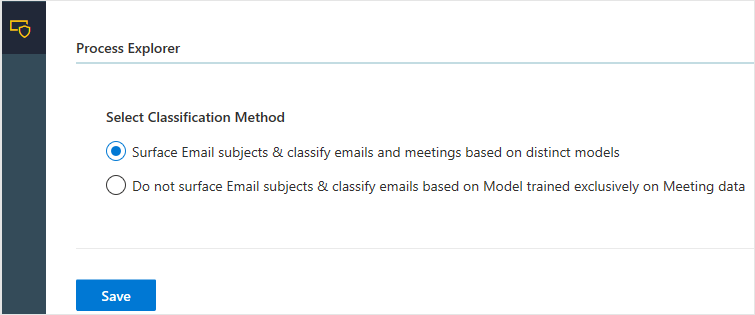

---

ROBOTS: NOINDEX,NOFOLLOW
title: Release Notes for Workplace Analytics Azure Templates
description: Learn about what new Azure Templates or new functionality has been released for Workplace Analytics
author: madehmer
ms.author: madehmer
ms.topic: article
localization_priority: normal 
ms.prod: wpa
ms.collection: M365-analytics
manager: scott.ruble
audience: Admin
---

# What's new in Workplace Analytics Azure Templates

Azure templates for Workplace Analytics will continue to develop new templates and add new features and enhancements to the current set of templates. This page will be updated monthly with each new release.

## March 2020

The following new template and template features, enhancements, and changes are in this month's release.

### Join Datasets Azure Template

The new Join Datasets Template enables you to securely join, group, and aggregate data exported from Workplace Analytics with other third-party data sources, such as sensitive, personnel data or HR data that you want to combine and analyze.

This template enforces the same data privacy settings that you set in Workplace Analytics, such as minimum group size, data exclusions, and other privacy settings. Note, this template requires the HR manager to upload additional identifier data into Workplace Analytics during the HR data upload process.

To learn more, see [Join Datasets Azure Template](./join-datasets.md).

### Process Explorer Azure Template

* **Email thread analysis** - You can skip categorization and focus on email analysis. Analysts can use [Email Thread Analysis](./process-explorer.md#email-thread-analysis) to quickly access information about email activity throughout the organization, without manually categorize email beforehand. The time ranges and filter options are the same as what's available for categorization analysis. An email thread includes a sent email and all its succeeding replies. This automated analysis includes the number of email threads, total emails sent, distinct touchpoints, hours of email workload, a number of thread averages, and more thread details in a downloadable table.
* **Time spent on categories** - After categorizing a dataset, you can view time spent on specific categories in the **Time Spent on Category** section below the **Category Distribution** section of the dashboard. The following is available with this chart view:

  * **Hours on Topic** - Shows the total number of hours spent based on the filters selected for the chart data, including the selected topics (categories) and communication types (all, email, or meeting activity) that have been categorized for the dataset for the selected period of time.
  * **Topic Filter** - Select a specific topic to focus the chart on. The default is All, which shows all categories used in the dataset.
  * **Communication Filter** - Select to filter the chart to view only email or meeting activity. The default is All, which shows all email and meeting activity that was categorized in the dataset.
  * **Time Filter** - Select what period of time you want to see chart data for, such as last month, last quarter, last six months, or last year. The default is All, which shows all time periods available in the dataset.

* **Aggregated subject list for categorizing email and meetings** - When categorizing email or meetings, the list now aggregates email or meetings with the same subject into one line in the list, so you can categorize them all at the same time. The new **Frequency** column shows how many meetings or emails have the same subject.
* **Classify on raw data only** - To simplify dataset classifications, the option to only use meeting query data to analyze and categorize is no longer available. Classify on raw data, such as blob storage, is the only dataset option moving forward.

To learn more, see [Process Explorer Azure Template](./process-explorer.md).

### Organizational Network Analysis (ONA) Azure Template

* **Microsoft Teams signals** - You can now include Teams call and chat activity in your network analysis, independently or in any combination with emails and meetings. Note that if you include meetings and Teams calls in your analysis, only unscheduled calls are counted as Team calls to avoid double counting meeting call activity.
* **Advanced Threshold settings** - New settings now available to specify thresholds for interactions, such as a minimum number of emails, meetings, chats, calls, and interactions across two or more types.
* **Multiple network boundaries analysis** - For subgroup analysis, you can now analyze all values for a specific HR attribute by selecting **Multiple Network Boundaries**. After the subgroup analysis runs, you can download it as a .csv file for further analysis.
* **Additional monthly data** - For subgroup analysis, you can select to compute monthly totals within the specified time period in addition to the totals for the full time period selected.
* **Graph view update** - For graph views, the link thickness and color darkness are now set on by default. The line thickness and color darkness are based on how much time was spent between groups, where the thickest and darkest links are the ones with the most time spent between groups. You can change these defaults in Settings within the graph view.
* **New color-by graph options** - For graph view, you can now select specific metrics to color the graph by, such as by degrees, influence index, bridging index, and boundary spanning. The resulting graph will have nodes colored by using a heat map gradient with the following color scheme. Note that this color-by option is unavailable in Combined View.

  * The lowest values on one end of the spectrum show as *light yellow*.
  * The highest values on the opposite end show as *bright red*.
  * The nodes representing values in the middle show as variations of *orange*.

* **100K node support** - The graph view now supports 100,000 nodes with the Combined View option.
* **Density table view improvements** - New labels available for the sender and receiver of communications within the Density table view. New breadcrumbs show at the top to improve navigation.
* **Normalized metrics** - The modularity metrics are now normalized throughout ONA.

To learn more, see [Organizational Network Analysis Azure Template](./organization-network-analysis.md).

### Deploy and Configuration updates

* **New UX changes** incorporated into the [Deployment steps](./deploy-configure.md#deployment).
* New **API User** and **Data Owner** roles and **Scenario** options available when adding users for these templates. See [Add users and assign roles](./deploy-configure.md#add-users-and-assign-roles) for details.
* For the new **Join Datasets Template**, you can set the number of days to retain data created and saved as joined datasets with the template.

To learn more, see [Deploy and configure Workplace Analytics Azure Templates](./organization-network-analysis.md).

## January 2020

The following new template enhancements and changes are in this month's release.

* The **Job Details** information for datasets now includes an **Error Message** column (last on the right) with more information about dataset failures for both the Organizational Network Analysis and the Process Explorer Azure Templates.

### Organizational Network Analysis Azure Template

* A new **Download interaction matrix** option to download a .csv file with the person interactions and related data, such as date range and connection weights by hours and counts.
* When viewing Density graph data, the higher density (*orange*) and lower density (*blue*) cells are highlighted based on the modularity. The color indicates whether or not a group is more or less connected in the network, as compared to what's expected with a random network. See [Density](./organization-network-analysis.md#density) for more details.
* New option for monthly metrics generated for chart data, which computes both individual and group metrics for the set time period and for each month within that time period.
* Reach Index is no longer a chart option.

To learn more, see [Organizational Network Analysis Azure Template](./organization-network-analysis.md).

### Process Explorer Azure Template

* New filter options in the **Query Builder** > **Filter Dataset** to select which meetings or emails you want to include or exclude in the data list for training the categorization model.
* A new **Save Categorization Model** option lets you save a model to reuse later, which can save you time and gives you the ability to analyze historical data patterns over different time frames.
* Pie chart visuals of categorized data now exclude the **Uncategorized** category, which enables you to focus on and analyze the data that you spent time categorizing.

To learn more, see [Process Explorer Azure Template](./process-explorer.md).

## December 2019

The following new template enhancements are now available.

### Organizational Network Analysis Azure Template

The following enhancements and features are included in the Organizational Network Analysis (ONA) Azure Template.

* Updated UX for Node Measures, including renaming some of the measures, such as:
  * Eigen Centrality is now Influence Index
  * Closeness is now Reach Index
  * Network size is now Degrees
* Preliminary analysis now defaults to the Combined view of the graph. The Network view is only available when the node or link counts are less than the threshold settings defined by your Azure Templates admin in **Admin** > **Configuration**. For details, see [Other configuration options](./deploy-configure.md#other-configuration-options).
* Improved UX for defining analysis and saving subsets of data within the graph view. For details, see [To add new subgroup analysis](./organization-network-analysis.md#to-add-new-subgroup-analysis).
* New metrics available for subgroup analysis, including Boundary Spanning, Bridging Index, Influence Index, and Reach Index.
* New in-depth information about [Measure calculations](./ona-metric-calculations.md) for the Organizational Network Analysis Azure Template.

To learn more, see [Organizational Network Analysis Azure Template](./organization-network-analysis.md).

### Process Explorer Azure Template

The following enhancements and features are included in the Process Explorer Azure Template.

* New download option for datasets.
* Additional options (filters, time range) that help reduce the size of the training dataset for cloud storage, which is required to be less than five million meetings and emails, for improved interactivity when building and training the template model(s) for auto-categorization of the full dataset.
* New Process Explorer Admin setting that specifies if the template shows email subjects and requires categorization to train emails by using a distinct model, or if it trains both email and meetings by using only meeting data.

    

To learn more, see [Process Explorer Azure Template](./process-explorer.md).

## September 2019

The following new template enhancements are now available.

### Process Explorer Azure Template

The following enhancements and features are included in the Process Explorer Azure Template.

* The following new **Admin Classification** options where after you select and save the option in **Admin** > **Configuration**, it'll persist for the life of that scenario:
  * Surface email subjects and classify email and meetings based on distinct models.
  * Do not surface email subjects and classify email based on model training exclusively on meeting data.  
* Improved UX with a new dashboard layout for adding and editing categories, for categorizing meetings and email separately in different dashboards, and for analyzing data.
* If a dataset fails with the **Status** of a red x, you can use the new **Undo** action to revert to the last successfully saved version of the dataset.

To learn more, see [Process Explorer Azure Template](./process-explorer.md).

### Organizational Network Analysis Azure Template

The following enhancements and features are included in the Organizational Network Analysis (ONA) Azure Template.

* Improved UX for adding new analysis.
* New date range options for improved data and graph analysis.
* New **Download metrics** option for the last saved version of the analysis that aligns with the time range, filters, and other values selected.
* Select the new **Parameters** icon to view the parameter details for a listed dataset.

To learn more, see [Organizational Network Analysis Azure Template](./organization-network-analysis.md).

### Admin logs

As an admin, you can now audit user activity in **Admin** > **Logs**. Select the **information** (i) icon in the **Message** column to see more details about a specific  activity.

## August 2019

The following new template and template enhancements are now available.

### Process Explorer Azure Template

This release adds a new Process Explorer template that helps you understand where your organization or team is investing or expending valuable time. You can use this template to categorize processes, projects, meetings, and other activities. You can either upload a .csv dataset for meeting activity or connect to a blob storage location for meeting and email activity.

To learn more, see [Process Explorer Azure Template](./process-explorer.md).

### Organizational Network Analysis Azure Template

The following enhancements and features are included in the Organizational Network Analysis (ONA) Azure Template.

#### Comparative analysis

With the ONA template, you can now view and compare two networks side by side with two browser windows, such as to compare:

* Two different time periods to see how a network has evolved (before and after analysis)
* Between different metrics, such as betweenness and intersectionality, for the same time period
* Two different filters, such as by job title and level designation, for the same time period

#### Density measure

You can now analyze cohesion within groups and across groups by density, which is a new measure in the ONA template. This table view depicts the density score within and across the respective groups.

#### Save and view saved graphs

You can now save a data analysis graph in the template, and then view it as a saved graph later.

To learn more, see [Organizational Network Analysis Azure Template](./organization-network-analysis.md).

## Related topics

* [Workplace Analytics Azure Templates overview](./overview.md)
* [Deploy and configure Workplace Analytics Azure Templates](./deploy-configure.md)