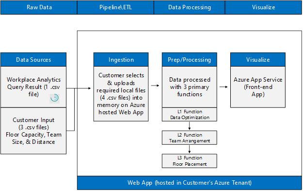
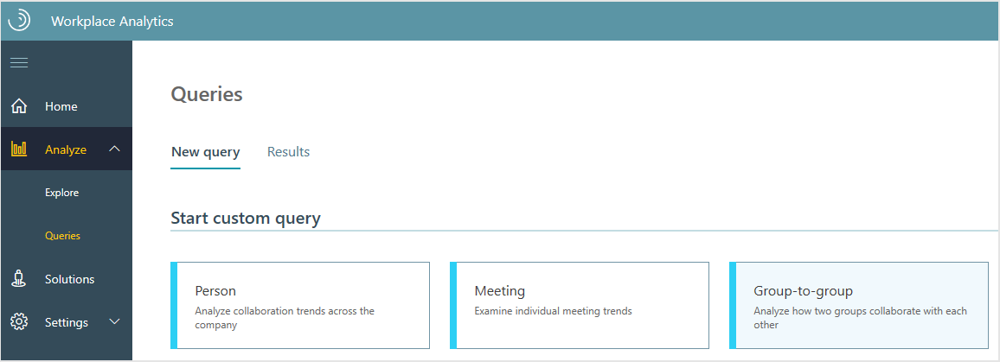
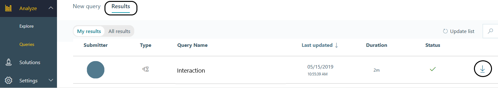
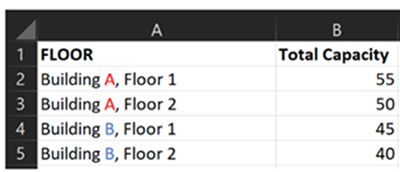
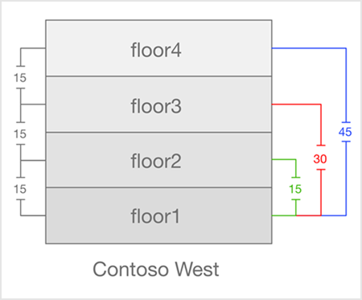
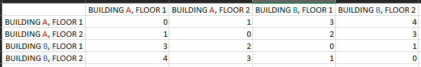
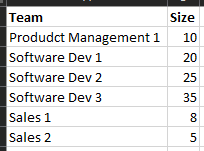
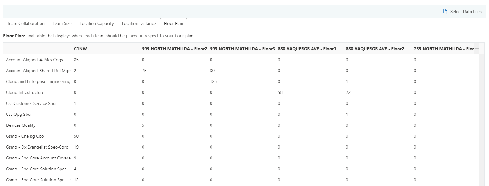
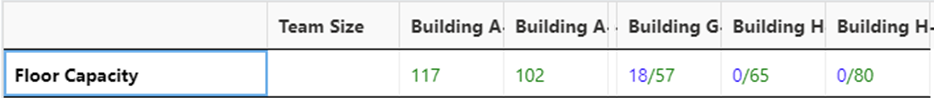

---

ROBOTS: NOINDEX,NOFOLLOW
title: Workspace Planning Azure Template for Workplace Analytics 
description: Learn about the Workspace Planning Azure Template for Workplace Analytics and how to use it for advanced data analysis
author: madehmer
ms.author: v-mideh
ms.topic: article
localization_priority: normal 
search.appverid:
- MET150
ms.prod: wpa
ms.collection: M365-analytics
manager: scott.ruble
audience: Admin
---

# Workspace Planning Azure Template for Workplace Analytics

_These templates are only available as part of a Microsoft service engagement._

Workplace Analytics Azure Templates include the Workspace Planning template that provides a quantitative solution to optimize the seat locations of teams based on their collaboration with the teams around them. This planning can help maximize and foster physical workspace for teams and for cross-team productivity and collaboration.

The template combines Workplace Analytics data with your team size, workspace capacity, and the distances between seating areas to generate an optimized floor plans.

## Use cases

* **Moving to a new workspace** and your organization wants to know the best workspace plan for employees within a building for optimal cross-team collaboration.
* **Reorganizing an existing workspace** and your organization wants to generate an optimized floor plan and compare it to the current floor plan, based on current communication patterns.

## How it works

This template combines Workplace Analytics data with your team size, workspace capacity, and the distances between the floors and the buildings to generate floor plans with recommended seating.

* [Interaction](#create-an-interaction-file) - This is a Workplace Analytics group-to-group query that includes meeting and email activity for insight into current work and collaboration patterns.
* [Space capacity](#create-a-space-capacity-file) - This file includes details about the maximum capacity for the workspace.
* [Distance](#create-a-distance-file) - This file includes details about the walking distances in a unit you specify, such as minutes or meters that can be estimates, between floors or buildings.
* [Team size](#create-a-team-size-file) - This file includes details about the number of employees in each team in your organization.

This template combines the data in these files and generates a table that shows where to seat people in the specified floor plan.

   

## Key features

* **Seating Optimization** - Generates seating assignments for teams that reduces the distance between teams who have the most collaboration with each other.
* **Fixed Spaces** - Allows the user to fix specific teams to particular locations and then optimize the remaining teams around them such that teams are situated nearest to teams who they have the most collaboration with.
* **Interactive mode** - Enables you to interactively change the floor plan results, such as the number of team members on each floor or in each office, within the application, and then it updates the results to reflect these changes.
<!--* **Co-located teams** (coming soon) - Enables you to specify a constraint that a certain number of seats for a team must be adjacent to another team. For example, certain number of seats of Team 1 are always close to Team 2. Requires a different version of the team_size.csv input file.-->
<!--* **Relative constraints** - Specify a specific distance or collaboration constraint for certain teams. For example, Team 1 must be seated in a workspace that is less than 15 minutes from Team 3. You need to use the additional **constraints.csv** input file for these.-->

## Deploy and configure the template

1. Confirm you meet the [Prerequisites](deploy-configure.md#prerequisites) for deploying the template.
2. Complete the steps to [Deploy and configure](deploy-configure.md#deployment) the template.

## Create an Interaction file

1. Confirm you are assigned the [Analyst role in Workplace Analytics](../use/user-roles.md), which is required to create this file.
2. Sign in as an Analyst and open [Workplace Analytics](https://workplaceanalytics.office.com/Home).
3. Select **Analyze** > **Queries**.
4. In **Start custom query**, select **Group-to-group query**.

   

5. Enter or select the following to create the query.

   * Name: **Interaction**
   * Group by: **Week**
   * Time period: **3 months** (to start with)
   * Meeting exclusion: **Tenant Default Meeting Exclusion Rule**
   * Select metrics: **Collaboration Hours**
   * Time investors
      * Group the time investors by: **Organization**
      * Limit the analysis to certain time investors: *None*
   * Their collaborators
      * Exclude collaborators: *None*
      * Group people who collaborated with time investors: **Organization**
      * Focus analysis on a set of collaborators: *None*

6. At the top right, select **Run** to create the query.
7. After the query is successfully created, in **Queries** > **Results**, locate and select the **Download** icon for your new Interactions query, and then save the zipped file.

   

8. Locate and right-click the **interaction.zip** file, select **Extract all**, and then select **Extract** and specify the folder.
9. Confirm the new file is named (or rename it as) **interaction.csv** (exact file name is required).

## Create a Space capacity file

### Key term

**Total_Capacity** is the total number of individual desks and office seats that are available within a specified workspace.

> [!Note]
> Only include spaces that you want to account for or utilize.

1. Open and save the [space_capacity.csv](https://docs.microsoft.com/Workplace-Analytics/azure-templates/images/space_capacity.csv) file to local storage. The file must be named **space_capacity.csv** (match exactly).
2. In the **Floor** (first) column in the file, replace the example floor names with your own that match the same format of [**Building name**-**Floor number**], as shown in the following graphic.

   * Use valid characters, including: **a-z**, **A-Z**, **0-9**, "**-**" (dashes), and " " (spaces)
   * Do not use invalid characters, including: "**_**" (underscores) and "**,**" (commas)

3. In the **Total Capacity** column, enter the maximum capacity for each floor.
4. If you have office seat variables to define, continue to the next set of steps. Otherwise, save and close the file.

   

## Create a Distance file

> [!Note]
> * Distances between buildings, floors, or zones within a floor must be defined. Any single unit, such as meters, feet, seconds, or minutes, can be used if it is used consistently. **Estimates of distances are acceptable**.
> * For distances between floors directly above and below each other, use a default value of 15.
> * Start your distance measurements by walking at a normal pace across the furthest distance of teams on a single floor. This will be used as the benchmark distances of all teams throughout the campus. Consider asking your customer support advisor for guidance on how to efficiently generate this file.

### About floor distance

The following graphic depicts a building with four floors. The distance between each parallel floor needs to be the same consistent value. You can use the default value of 15 for parallel floors, which is a good estimate of how long it takes to get from one floor to the next in the same building.

   

### To create a Distance file

1. Open and save the [distance.csv](https://docs.microsoft.com/Workplace-Analytics/azure-templates/images/distance.csv) file to local storage.
2. In the first row and the first column, replace the example data with the locations you want processed with the structure that match the same format of [**Building name**-**Floor number**], similar to the data shown in the following graphic.
3. Starting in the second row and column, enter the distances where the corresponding locations intersect to denote the distance between the two locations.
4. Save and close the file.

   

## Create a Team size file

> [!Note]
> Employees can only be included in one team.

### Key terms

* **Team** is the name of the team or group that is being moved, which should match the names of the teams within the Interaction file.
* **Actual Size** is the total number of people that are a part of the team to account for during the move.

1. Open and save the [team_size.csv](https://docs.microsoft.com/Workplace-Analytics/azure-templates/images/team_size.csv) file to local storage.
2. Starting in the second row, replace the example data with your own that matches the same format, similar to what's shown in the following graphic.

   * **Team** - Enter the name or function of each team.
   * **Actual Size** - Enter the number of employees that are in each corresponding team.

3. Save the file, and continue to the next set of steps.

   

<!--### For co-located teams

1. In the **team_size.csv** file you just created in the previous set of steps, add a new column named **Adjacent Size**.
2. Add another new column and name it for the team to which you want to enforce adjacency.
3. For each row in the new team column, enter the number of team members you want to place next to each team, entering a 0 for the row that has the same team name.
4. In the **Adjacent Size** column, for the rows that are not the same team as the new column, add the Size column and the value in the new team column.  For the row that matches the team name in the new column, total the new Team column. And then subtract that sum from the **Size** column and enter that value in the **Adj Size** cell.

   

### For office seat variables

1. In the **team_size.csv** file you just created in the previous set of steps, add a new column and name it **Workpoint Seats**, which represents how many standard desk seats (shared desks or open space) the team needs.
2. Add an additional column and name it **Office Seats**, which represents how many office seats (desks assigned to one person) the team needs. If a single office is assigned to two people, count it as two office seats.
3. Enter the number of workpoint seats required for each team. If no workpoint seats are required for a team, enter 0.
4. Enter the number of office seats required for each team. If no office seats are required for a team, enter 0.
5. Your final floor plan should look similar to the following graphic.
6. Save and close the file.

   

## Generate a Constraints file

> [!Note]
> If you do not create a constraint for a team, an optimized floor plan will still be created.

1. Open and save the **constraints.csv** file to local storage.
2. Set the **Constraint Type** to **Distance**.
3. In the **From** column, enter the names of your source teams that you used in the **team_size.csv** file (the names must match between these two files).
4. In the **To** column, enter the names of the destination teams that match the team names you used in the **team_size.csv** file (the names must match).
5. In the **Eq(<, >, =)**  column, enter a constraint:

   * Use **<** (less than) to connect two teams.
   * Use **>** (greater than) to separate two teams.
   * Use **>=** (greater than or equal to) to separate two teams the same way as ">", but also includes the value used to compare against.

6. Enter the applicable amount on a scale of **1 -100** where **1** is for having teams be as close together as possible and **100** is for as far away as possible. Add as many team combinations as you require.
7. Save the file in the same locations as the four base files.
8. When selecting the relative constraints feature as you see above, make sure to select all five files.

   In the following example, the first constraint defines that Team 1 be as close as possible to Team 2. The second constraint defines Team 3 be as far away as possible from Team 4.

   -->

## Generate a Floor Plan

1. In the Workspace Planning Azure Template, select **Space Planning** on the left.
2. Click **Select Data Files** at the top right.
3. Select **Choose File**, and then select all four .csv data files that you created in the previous steps (interaction, space_capacity, distance, and team_size) and if you selected relative constraints in the constraints.csv file, select it as well.
4. Select **Submit**, which results in a new page for each file and a Floor Plan page
that shows the calculated floor plans and how many employees from a team can sit where.

   

### Floor capacity color key

* The base **green** number represents the total capacity available on that floor.
* When the number is in the [numerator/denominator] format:

  * **red** represents a floor that's been over allocated and is currently over capacity
  * **blue** represents a floor that's under allocated, which is not usually an issue, but good to know about

   

### Team size color key

* The base **green** number represents the total size for that team.
* When in the number is in the [numerator/denominator] format:

  * **red** represents a team with more team members being accounted for than members available on the team
  * **orange** represents a team where not all the members on the team are accounted for or placed

   

## Activate Fixed Spaces

After generating an optimized floor plan, you can clear the floor plan, locate related teams to specific locations, and re-run the optimization:

1. Select the **Fixed Spaces** option (top left) for the floor plan, which will clear the current floor plan and revert all values to zero.
2. Select and change the zero value for a team location to the number of members of the team you want to locate in that space.
3. Repeat Step 2 until you have entered values for all the teams you want to locate in this floor plan.
4. Select **Update Floorplan** to generate an optimized floor plan with these updated fixed values.

> [!Note]
> The more teams you assign to fixed locations, the less optimized the floor plan can be.

## Related topics

* [Workplace Analytics Azure Templates overview](./overview.md)
* [What's new in Workplace Analytics Azure Templates](./release-notes.md)
* [Deploy and configure Workplace Analytics Azure Templates](./deploy-configure.md)