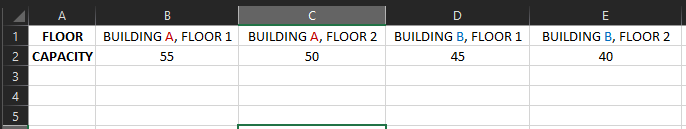

---
# Metadata Sample
# required metadata

ROBOTS: NOINDEX,NOFOLLOW
title: Workspace Planning Azure Template for Workplace Analytics 
description: Learn about the Workspace Planning Azure Template for Workplace Analytics and how to use it for advanced data analysis
author: madehmer
ms.author: v-midehm
ms.topic: article
localization_priority: normal 
ms.prod: wpa
ms.collection: M365-analytics
manager: scott.ruble
audience: Admin
---
# Workspace Planning Azure Template for Workplace Analytics

_These templates are only available as part of a Microsoft service engagement._

Workplace Analytics Azure Templates include the Workspace Planning template that enables a quantitative solution to effectively identify and seat teams in a specified workspace. This planning can help maximize and foster physical workspace for teams and for cross-team productivity and collaboration.

The template combines Workplace Analytics data with your team size and workspace floor capacity and distances between floors and buildings to generate floor plans with recommended seating.

## Use cases

* **Moving to a new workspace** and your organization wants to know the best workspace plan for employees within a building that'll promote the most effective team and cross-team collaboration.
* **Reorganizing an existing workspace** and your organization wants to generate an optimized floor plan and compare it to the current floor plan, based on current communication patterns.

## How it works

Workspace Planning is fully hosted and operates within your existing Azure subscription. It requires the following input files (.csv) that you create by following the corresponding instructions on this page.

 * [Interaction](#to-create-an-interaction-file): This is a Workplace Analytics group-to-group query that includes meeting and email activity for insight into current work and collaboration patterns.
 * [Floor capacity](#to-create-a-floor-capacity-file): This file includes details about the maximum capacity for the workspace.
 * [Distance](#to-create-a-distance-file): This file includes details about the walking distances in a unit you specify, such as minutes or meters that can be estimates, between floors or buildings.
 * [Team size](#create-a-team-size-file): This file includes details about the number of employees in each team in your organization.

This template combines the data in these files and generates a table that shows where to seat people in the specified floor plan.

   

## To create an Interaction file

1. Confirm you are assigned the [Analyst role in Workplace Analytics](../use/user-roles.md), which is required to create this file.
2. Sign in as an Analyst and open [Workplace Analytics](https://workplaceanalytics.office.com/Home).
3. Select **Analyze** > **Queries**.
4. In **Start custom query**, select **Group-to-group query**.

   

5. Enter or select the following to create the query.

   a. Name: **Interaction**
   b. Group by: **Week**
   c. Time period: **3 months** (to start with)
   d. Meeting exclusion: **Tenant Default Meeting Exclusion Rule**
   e. Select metrics: **Collaboration Hours**
   f. Time investors

      * Group the time investors by: **Organization**
      * Limit the analysis to certain time investors: None

   g. Their collaborators

      * Exclude collaborators: None
      * Group people who collaborated with time investors: **Organization**
      * Focus analysis on a set of collaborators: None

6. At the top right, select **Run** to create the query.
7. After the query is successfully created, in **Queries** > **Results**, locate and select the **Download** icon for your new Interactions query, and then save the zipped file.

   

8. Locate and right-click the **interaction.zip** file, select **Extract all**, and then select **Extract** and specify the folder.
9. Confirm the new file is named (or rename it as) **interaction.csv** (exact file name is required).

## To create a Floor capacity file

1. Open and save the [floor_capacity.csv](https://docs.microsoft.com/Workplace-Analytics/azure-templates/images/floor_capacity.csv) file to local storage.
2. On the first row in the file, to the right of **Floor**, replace the example floor names with your own that match the same format of [**Building name** - **Floor number**], as shown in the following graphic.
3. In the Capacity row, replace the example numbers with the maximum capacity for each of the corresponding floors listed.
4. Save and close the file.

   

## To create a Distance file

> [!Note]
> * You need the measures of distances between floors, which can be any unit, such as minutes, seconds, or meters, and can also be estimates.
> * For distances between floors directly above and below each other, use a default value of 1.
> * You also need the measures of distances between working spaces. For example, the distance between [Building A, Floor 1] and [Building A, Floor 2] the starting and ending points of measure need to be between clusters of employee seating arrangements and not entrances to the floor.

1. Open and save the [distance.csv](https://docs.microsoft.com/Workplace-Analytics/azure-templates/images/distance.csv) file to local storage.
2. In the first row and the first column, replace the example data with the locations being processed with the structure that match the same format of [**Building name** - **Floor number**], such as in the following graphic.
3. Starting in the second row and column, enter the distances where the corresponding locations intersect to denote the distance between the two locations.
4. Save and close the file.

   

## Create a Team size file

> [!Note]
>Employees can only be included in one team.

1. Open and save the [team_size.csv](https://docs.microsoft.com/Workplace-Analytics/azure-templates/images/team_size.csv) file to local storage.
2. In the second row, replace the example data with your own that matches the same format, as shown in the following graphic.

   a. **Team**: Enter the name or function of each team.
   b. **Size**: Enter the number of employees that are in each corresponding team.

3. Save and close the file.

   

## To generate a Floor Plan

1. In the Workspace Planning Azure Template, select **Space Planning** on the left.
2. Click **Select Data Files** at the top right.
3. Select **Choose File**, and then select all four .csv data files that you created in the previous steps (interaction, floor_capacity, distance, and team_size).
4. Select **Submit**, which results in a new page for each file and a Floor Plan page
that shows the calculated floor plans and how many employees from a team can sit where.
 
   

## Related topics

* [Workplace Analytics Azure Templates overview](./overview.md)
* [What's new in Workplace Analytics Azure Templates](./release-notes.md)
* [Deploy and configure Workplace Analytics Azure Templates](./deploy-configure.md)