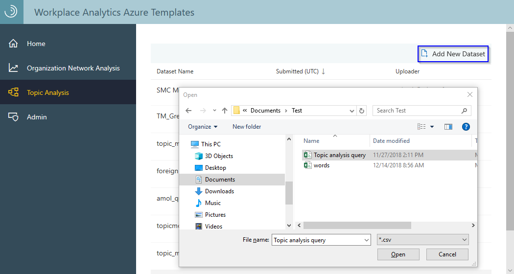
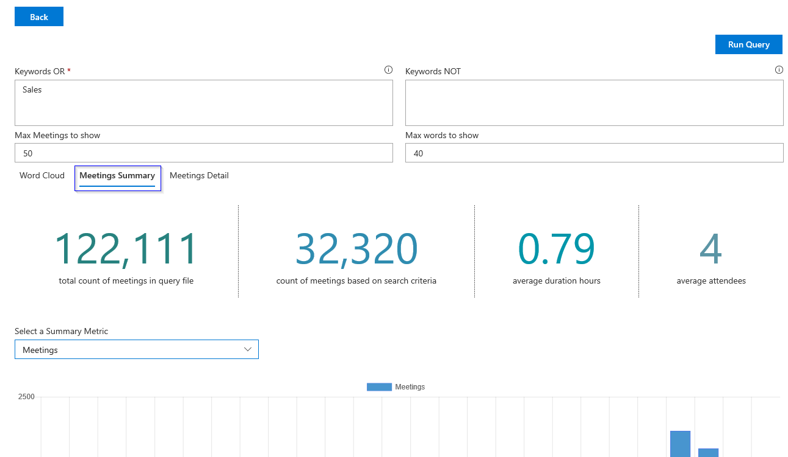
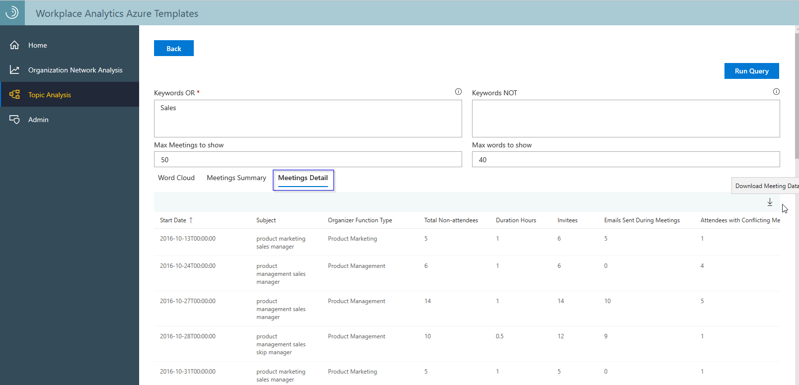

---

ROBOTS: NOINDEX,NOFOLLOW
title: Topic Analysis Azure Template for Workplace Analytics 
description: Learn about the Topic Analysis Azure Template for Workplace Analytics and how to use it for advanced data analysis
author: madehmer
ms.author: v-midehm
ms.topic: article
localization_priority: normal 
ms.prod: wpa
ms.collection: M365-analytics
manager: scott.ruble
audience: Admin
---
# Workplace Analytics Topic Analysis Azure Template

_These templates are only available as part of a Microsoft service engagement._

Workplace Analytics Azure Templates includes the Topic Analysis template that enables you to quickly analyze a range of metrics about meetings based on topic keywords. You can use these metrics to evaluate who spent how much time in key meetings and reading and sending emails about these key meetings.  

You can use this template to view and analyze meeting metrics with the following features.

* **Word Cloud**: After you select a dataset and run a query with an initial keyword, the Word Cloud shows keywords that are relevant or close to the initial keyword. You can then select another keyword in the cloud to add to your list and run the query again. Each time, the cloud adjusts based on the keywords listed. It'll include meeting subjects that contain any of the keywords (OR) or a combination of the keywords (AND). The larger the word, the more closely it relates to the initial keyword.
* **Meetings Summary**: Summarizes the key data points about the meetings in the query, including: the total count of meetings, the count of meetings based on search criteria, the average duration hours, and the average number of attendees. It also provides a chart view of the data that you can change by selecting different meeting metrics to show in the chart, such as meeting hours, emails sent, or conflicting meetings for attendees.
* **Meetings Detail**: Shows the meeting metric details in a table, which is based on the query search criteria and the organizational data imported from Workplace Analytics. You can sort the table view by the Meeting Start Date. You can also download the meeting details as a .csv file for further analysis in another tool, such as Excel or Power BI.

## Analyze topic data

### To add a new dataset

1. In Workplace Analytics Azure Templates, select **Topic Analysis**.
2. Depending on the analysis, select either **Flexible Query** or **Meeting Composition**.
3. Select **Add New Dataset** (top right), and then locate and select the dataset you want to import and analyze.

   

### To run a query for analysis

1. Select the name of the dataset you want to analyze.
2. To search for keywords in meeting subjects or titles, enter one or more keywords, separated by commas, in one of the **Keyword** boxes. To search for word phrases, separate the phrase with an underscore (for example **product_marketing**). Or to search for word phrases in any order, separate the words with spaces (for example **product marketing managers**).

   * **Keywords OR**: Includes meeting titles with words that contain any of the words entered or any combination of these words (phrases separated with spaces).
   * **Keywords NOT**: Meeting titles with these words are excluded from the search and data analysis.

3. Select **Run query**.
4. In the **Word Cloud**, you can select other keywords to add to the **Keywords OR** box, and then select **Run query** again to update the cloud view to include the additional words you added, as shown in the following graphic.

   

5. You can then select **Meetings Summary** to view key meeting data points about the following metrics.

   Meetings Summary metrics |Description
   ------------------------|------------
   Total count of meetings in query file (Meetings) | Total number of meetings that are in the query file.
   Count of meetings based on search criteria | Total number of meetings that match the search criteria.
   Average duration hours | The average number of hours for the meeting length for the meetings in the search criteria.
   Average attendees | The average number of people who attended the meetings that match the search criteria.
   Summary metrics | Based on the organizational data imported from Workplace Analytics. For details, see [Meeting metrics](../use/metric-definitions.md#meeting-metrics).

   The following diagram shows an example of the metrics available on the **Meetings Summary** page. You can select a **Summary metric** to change what data shows in the chart.
   

6. You can select **Meetings Detail** to view the available meeting metrics in a table or export them as a .csv file.

   

## Related topics

* [Workplace Analytics Azure Templates overview](./overview.md)
* [What's new in Workplace Analytics Azure Templates](./release-notes.md)
* [Deploy and configure Workplace Analytics Azure Templates](./deploy-configure.md)
* [Organization Network Analysis Azure Template](./organization-network-analysis.md)
* [Process Explorer Azure Template](./process-explorer.md)
