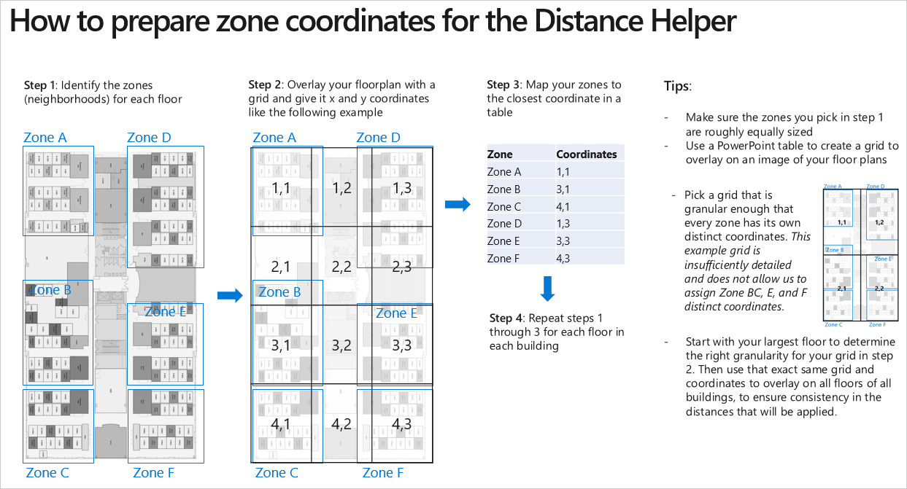
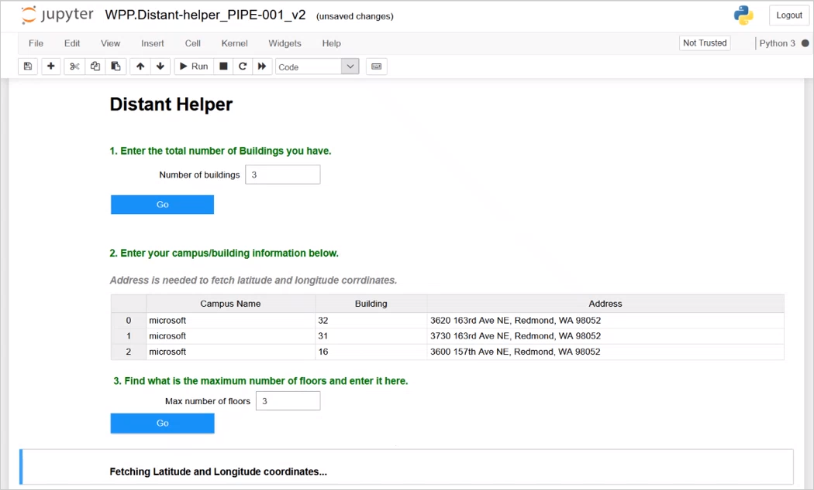
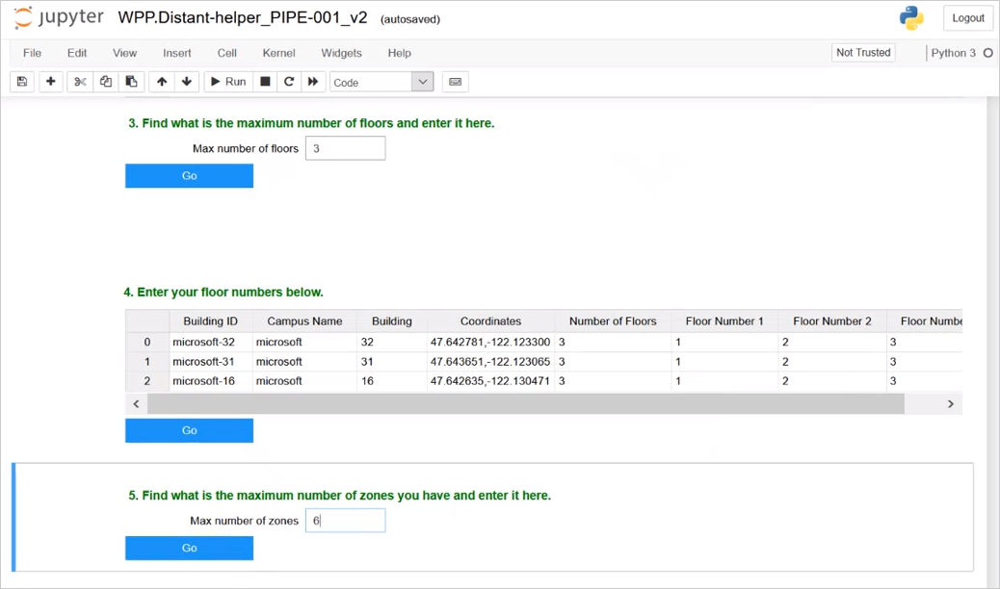
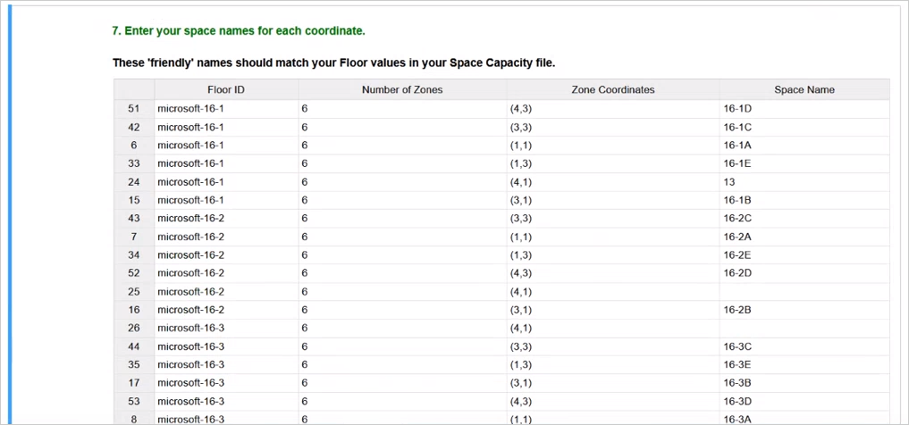
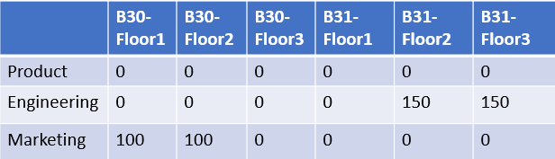

# Workspace planning tool

If your team or company is moving to a new worksite or you need to reorganize an existing workspace, this open-source tool can help. Workspace planning can help you identify and seat teams together in a workspace that maximizes and fosters cross-team productivity and collaboration. You can use this tool to generate floor plans quickly and objectively, in a data-driven way that optimizes employee collaboration by seating teams together.

The algorithm for this tool accounts for the following rules and constraints:

* **Teams stay together** - When a workspace can seat everyone on the team, it will keep them all together.
* **Teams who collaborate the most sit together** - Based on the collaboration patterns and the distances between spaces, if team A spends most of its time with team B, the two teams are assigned workspaces that are as close together as possible.
* **The most central team is in the most central workspace** - As lower priority than the previous two, the tool can help you determine which floor plans are better than others for seating specific teams in central locations.
* **Everyone gets a seat** - All team members get an assigned seat in a workspace.
* **People and seat assignments must match** - No workspace is assigned more people than it has seats for and no workspace can have a negative number of people assigned to seats.

You can create seating plans that require different variables, such as the following:

* Colocate teams who collaborate the most with each other within the same multi-floored building that has multiple zones or neighborhoods.
* Cross-team collaboration around constraints for specific teams. For example, the HR team must be located together on the first floor in the same neighborhood and Zone A must be next to the file room.
* Create seating for alternating or rotating work schedules for teams who share a workspace on different weeks or days.

## Prerequisites

Before you can use the tool, confirm the following required prerequisites are met.

* **Anaconda** - Use to install and manage the following required versions of Python and Jupyter Notebook. See [Anaconda](https://www.anaconda.com/products/individual#windows) to install it. During the installation, select to **Register Anaconda as your default for Python**.
* **Python** - Latest available or version 3.3 or later is required.
* **Jupyter Notebook** - An open-source application that's required to run the Workspace planning tool.

## File prep

Save the following files to a **master folder**. You'll use this master folder to create a copy of for each workspace project.

* **Distance Helper notebook** - Creates a distance file between specified zones or neighborhoods. This uses the following input files to help you define the walking distances in a unit you specify, such as estimated minutes or meters between floors or buildings.
* **File Validations notebook** - Validates all the input files, including the distance file that's created from the Distance helper notebook.
* **Generate Floorplan notebook** - Creates a floor plan from the validated input files and reruns the algorithm on the floor plan.
* **Requirements text file** - Documentation required for the tool.

### Input files

You also need to save the following input (.csv) files to your master folder. These files define the relevant information for each workspace project, such as team sizes and workspace capacity. The tool uses these to generate the floor plans with recommended seating for each team based on their collaboration patterns from the interaction file.

* [Interaction](space-planning.md#create-an-interaction-file) - This is a Workplace Analytics group-to-group query that shows current work and collaboration patterns across the different teams.
* [Team size](space-planning.md#create-a-team-size-file) - Defines the number of employees in each team in your organization.
* [Space capacity](space-planning.md#create-a-space-capacity-file) - Defines the workspace, which an be a combination of buildings, floors, and zones or neighborhoods, and the maximum capacities for each.

The tool combines the data in these files to generate a table that shows where to seat people in the specified floor plan.

## Plan a workspace

1. A Workplace Analytics Analyst needs to create the interaction file, which is a group-to-group query that shows the current work and collaboration patterns across the different teams. For detailed steps, see [Create an interaction file](space-planning.md#create-an-interaction-file).
2. Copy all the required files listed in [File prep files](#file-prep) and [Input files](#input-files) into a working folder for this workspace.
3. You can use PowerPoint like the following example to define the zone coordinates for each workspace building, floor, and zone:

   1. Copy a seating grid of each floor and identify your zones or neighborhoods.
   2. Overlay x and y coordinates for each zone.
   3. Map all the zones and coordinates in a table. These coordinates are required in the Distance helper notebook. The following shows an example of defining zone coordinates for a workspace floor.

   

4. Use a [Google Chrome browser](https://www.google.com/chrome/), which is required by Jupyter, to open the Anaconda navigator.
5. In Anaconda, launch Jupyter Notebook, and then locate and open the **Distance Helper notebook** in the master folder.
6. In the Distance Helper notebook, select **Run** at the top. For your first use, it will take a few minutes to load any necessary files, including the **Requirements.txt** data.
7. When prompted, enter the total number of buildings you have, and then select **Go**.

   

8. Enter the building information in the table, including the name, number, and complete address of each building. The tool needs the full address for accurate latitude and longitude coordinates.
9. In **Max number of floors**, enter the maximum number of floors for the buildings included in the overall workspace have, and then select **Go**. For example, if two of the buildings have two floors and one has three floors in the overall workspace, you'd enter three as the maximum number of floors for the workspace.
10. In the table, enter the numbers assigned to each floor in each building.
11. In **Max number of zones**, enter the maximum number of zones that you'll need to define for any of the floors in any of the individual buildings. For example, the following shows entering six as the maximum number of zones required for a floor in one of the buildings.

    

12. In the **Game of Zones** table, enter the floor names, number of zones, and corresponding zone coordinates for each building, which you defined in **Step 3**, and then select **Go**. For example, the following shows Floor 1 with 6 zones in building 30 that require zone coordinates of (1,1), (3,1), (4,1), and so on.

    

13. In the **Space Names** table, enter each floor's zone coordinates and a friendly space name that defines the building's floor number and zone. The following example shows a zone coordinate of **4,3** with a friendly space name of **16-1D**, which represents zone D on the first floor of building 16.

    

    >[!Important]
    >The friendly space names must match the floor names that you entered in the space_capacity.csv file.

14. Select **Go**, which saves a new distance.csv file with all your inputs in your working folder, and then select **Open Validations UI Notebook**.
15. In the **File Validations notebook**, select **Run** to validate the files that will be used to generate the floor plans.
16. When prompted to load the data, select the location for each of the files, as shown in the following graphic, and then select **Go** to validate them.

    

17. After validation, you'll see a green check mark for each file that passed and a red X for any that failed validation. For a red X, you can select **Show details** to troubleshoot why the file failed. After you have fixed any issues, repeat **Step 6** to validate the file again.
18. After all files are successfully validated, select one of the following input scenarios that the tool should use for seating teams in zones. These scenarios are based on the interactions file query data.

    * **Latest dates** - Groups the teams based on the most recent collaboration activity between teams.
    * **Average collaboration** - Groups teams based on the weekly averages of collaboration hours spent between the different teams.
    * **Total collaboration** - Groups teams based on the total number of hours the teams recently spent collaborating.
    * **Boost intra-collaboration** - Groups teams based on the "boosted" number of collaboration hours spent with two specific teams. You can change the **Boost Multiplier** setting that defines how to apply the boost. The maximum setting is 3, which will multiple the maximum number of collaboration hours by 3. This multiplied value replaces the existing collaboration hours for the two teams you specify.

19. The updated files are saved to a new **Final files set** folder. Any changes relating to these files are also saved to this folder.
20. Open the **Generate Floorplan notebook**, and then select **Run**.
21. Select **Standard** to get started. After you create a standard floor plan, you can do one of the following.

    * **Standard** - Select to create a new floor plan that's based on the validated files in the **Final Files set** folder. In **New results name**, enter a file name for it, and select **Go**.
    * **Fixed spaces** - If you want to change an existing (standard) floor plan, you need to edit the floor plan .csv file that was saved in **app_results**. When editing an existing floor plan, you must stay within the constraints set in the validated space_capacity.csv and team_size.csv files. You must also leave some teams unassigned for the algorithm to correctly assign seats within the set constraints. After you save the new changes to the floor plan file, select **Fixed**, and then select the updated floor plan file to use to create an updated floor plan. For example, the following graphic shows a standard floor plan where **Engineering** and **Marketing** are assigned to multiple locations.

     

    In the following example, the seat assignments have been changed (fixed) to keep the **Engineering** and **Marketing** teams closer together. Note, the **Product** team is left unassigned, so the fixed floor plan will keep the Marketing and Engineering team seat assignments unchanged and the Product team will be assigned to any unoccupied spaces based on the original input files in the Final Files set folder.

     

22. In the **app_results** folder, open the latest floor plan to see the seat assignments.

## Floor plan example

When you open a floor plan file, you’ll see teams assigned to zones or neighborhoods, which should match up to the team and zone names assigned in the space_capacity.csv and team_size.csv files.

The following shows an example floor plan where the Product team has 64 people assigned to Floor 1, Zone A and 16 people assigned to Floor 1, Zone B.

## Tips

* The best way to validate the output is to compare the collaboration levels in the collaboration file to the team seat assignment in the floor plan.
* The optimization of the floor plan might create a less than optimal plan because of the non-convexity of the constraints.
* Multiple, equally plausible floor plans can satisfy the same requirements, particularly when the collaboration between all the teams is very similar.
* The algorithm cannot interpret context (politics, hierarchy, or intentions) that a person could when allocating a workspace.
* When the algorithm creates a floor plan that is not optimal, be sure to use the **Fixed spaces** mode to improve the model predictions.

## Related topics

* [Workspace Planning Azure Template](space-planning.md)
