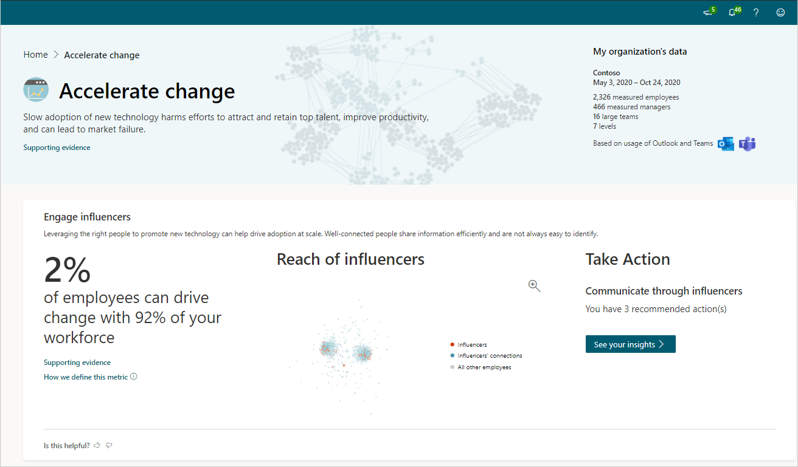

# Accelerate change insights

*This experience is only available through private preview at this time.*

> [!Important] 
> This insight is available only in organizations that have at least 200 licensed users. If your organization has fewer than that, you'll see an alert on the **Accelerate change** page that reads as follows: "This insight is unavailable because the minimum number of employees is not met."  

Slow adoption of new technology harms efforts to attract and retain top talent, improve productivity, and can lead to market failure. Influencers are employees who have the best connections to people across the company based on their collaboration patterns.

Engage influencers shows how your organization compares with others based on industry research and your specific organizational data.

## Calculations

The percentage metric for **Engage influencers** is **Percentage of employees who can drive change within your workforce**. This is the percentage of employees who are one step away from influencers. Influencers are the people with the best connections across the company.

The visual behavioral insight for **Engage influencers** is **Reach of influencers**, which is an [organizational network graph](glossary.md#ona-define) that shows the [influencers](metrics.md#influence-define), their connections, and how they effectively connect across your organization. This helps you identify and target the people who power the unobservable communication networks that can drive change.

## Take action

In the **Take action** section for each insight, select **See your insights** to see the most effective actions you can do now to drive change toward better business outcomes in your organization.

You also might see one or more groups listed who are affected and would benefit the most from these recommendations, which are based on your organizational data and industry research.

## Best practices

Leveraging the right people to promote new technology can help drive adoption at scale. Well-connected people share information efficiently, but are not always easy to identify.

The [Measuring your employees’ invisible forms of influence](https://insights.office.com/productivity/measuring-your-employees-invisible-forms-of-influence/) article says that "traditional organizational reporting structures limit managers’ visibility into how their employees are influencing and contributing to other teams. New workplace metrics are needed to help leaders get a more complete picture of this." Ways to leverage influencers:

* Use [Insights](https://docs.microsoft.com/workplace-analytics/myanalytics/use/use-the-insights) and the [Network](https://docs.microsoft.com/workplace-analytics/myanalytics/use/network) page to see connections, top collaborators, and suggestions on how to improve connections and cultivate influence.
* Use [Microsoft Teams channels](https://docs.microsoft.com/microsoftteams/teams-channels-overview) for cross-functional team collaboration and to drive conversations.

For more best practices and how to identify and utilize influencers, see [Best practices for influencers](https://docs.microsoft.com/workplace-analytics/tutorials/gm-influencer).

<!--### Measure Teams adoption

Successful digital transformations require a real-time understanding of technology adoption rates and usage trends within the organization. 

Based on [What email, IM, and the phone are each good for](https://insights.office.com/collaboration/what-email-im-and-the-phone-are-each-good-for/), you might be hampering productivity with too many emails: "We default to email to connect with people — to the tune of 122 business emails, on average, per person per day."

Some key ways to support Teams adoption:

* Launch a [champions program](https://docs.microsoft.com/MicrosoftTeams/teams-adoption-create-champions-program) for employees who are early adopters of Teams and can guide, teach, and train their peers.
* Use [Power BI Teams insights](https://docs.microsoft.com/workplace-analytics/tutorials/power-bi-teams) to monitor Teams usage through Workplace Analytics data, including instant messages, meeting, and email metrics.
* Share [Microsoft Teams free, live, online training classes](https://docs.microsoft.com/MicrosoftTeams/instructor-led-training-teams-landing-page) with employees to help get them up and running quickly with Teams.

For best practices and how to be a role model for Teams use, see [Best practices for efficient communication](https://docs.microsoft.com/workplace-analytics/tutorials/gm-communication).

### Support connectivity

Teams provides a shared work environment that strengthens connectivity and boosts productivity. Monitoring team cohesion post technology adoption is an indication of tool effectiveness.

[Rebuilding companies as communities](https://insights.office.com/culture/rebuilding-companies-as-communities/) explains how "Communityship requires a more modest form of leadership that might be called engaged and distributed management. A community leader is personally engaged in order to engage others, so that anyone and everyone can exercise initiative."

Ways to support connectivity with Teams:

* Share the collection of [Microsoft Teams training videos](https://support.microsoft.com/office/overview-of-teams-and-channels-c3d63c10-77d5-4204-a566-53ddcf723b46?wt.mc_id=otc_microsoft_teams) that help employees best use Teams, including how to experience all of the features of Channels.
* Learn tips and tricks on LinkedIn Learning, such as the [weekly Teams Tips video](https://www.linkedin.com/learning/microsoft-teams-tips-weekly/learn-tips-for-mastering-microsoft-teams?u=3322), to help employees master Teams and stay current on the latest Teams features and improvements.

For more best practices and how to host informal gatherings with Teams, see [Best practices for community connectivity](https://docs.microsoft.com/workplace-analytics/tutorials/gm-connectivity).
-->
