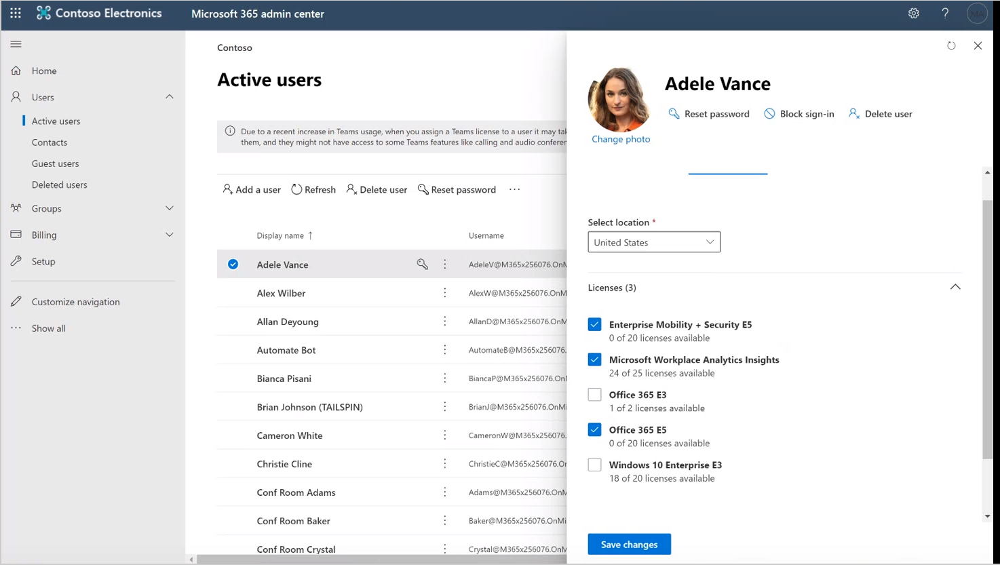
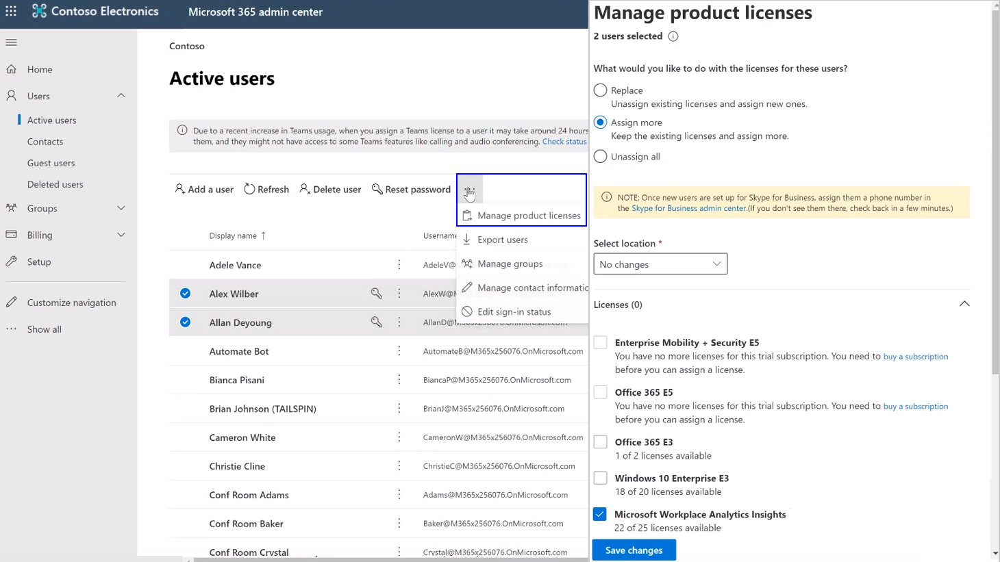
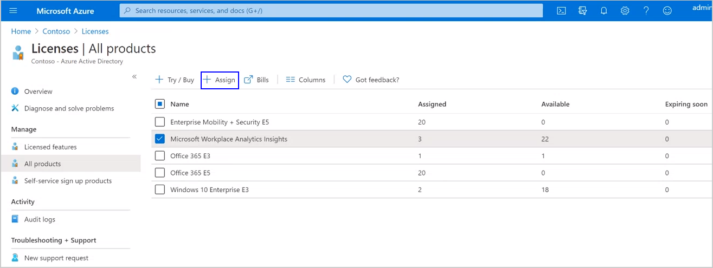
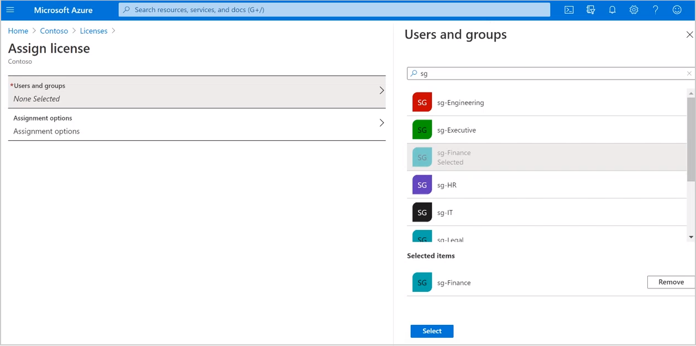
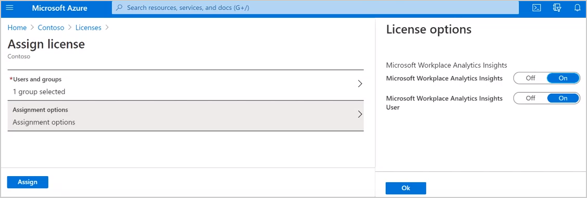

# Assign licenses

*This experience is only available through private preview.*

You can [assign licenses to one or more individual users](#to-assign-licenses-to-individual-users) in your organization for Microsoft Viva Insights in Microsoft Teams who subscribe to a Microsoft 365 or Office 365 E5 or E3 plan. To do this, you must first sign in to the Microsoft admin center as a global Microsoft 365 admin.

Alternatively, you can assign licenses as follows:

* [Assign licenses to one or more security groups](#to-assign-licenses-to-security-groups) as a Microsoft Entra global admin
* [Assign licenses with PowerShell](assign-licenses-pshell.md) as a global Microsoft 365 admin

## To assign licenses to individual users

1. Sign in as a global admin to your tenant's [Microsoft 365 admin center](https://admin.microsoft.com/adminportal).
2. In the left navigation, select **Active users**, and then do one of the following to assign licenses to one user or to multiple users at the same time.

   **For one user**:
   1. In **Active users**, select the user from the list.
   2. Select the **ellipsis** (**...**) to view more actions, and then select **Manage product licenses**.
   3. In **Licenses and apps**, select the checkbox for **Microsoft Workplace Analytics Insights** (synonymous with Microsoft Viva Insights).
   4. Select **Save changes**, as shown in the following graphic.

   

   **For multiple users**:
   1. In **Active users**, select the checkbox next to the users you want to assign licenses.
   2. Select the **ellipsis** (**...**) to view more actions, and then select **Manage product licenses**.
   3. Select **Assign more**, and then select the checkbox for **Microsoft Workplace Analytics Insights**.
   4. Select **Save changes**, and then select **Done**.

   

3. These licenses are assigned right away to the selected users.

## To assign licenses to security groups

1. In **Microsoft Entra ID**, select **Licenses** under **Manage**.
2. In **Overview**, select **All products**, and then select the checkbox for **Microsoft Workplace Analytics Insights**.

   

3. Select **Assign**, and then select **Users and groups** to open the right pane.
4. Search for one or more group names, select each group from the list to add it to the **Selected items** list, and then choose **Select**.

   

5. Select **Assignment options** to open the right pane, confirm that both **Microsoft Workplace Analytics Insights** are set **On**, and then select **OK**.

   

6. It can take a few minutes up to 24 hours for the license assignments to update to the server, which is based on your specific server settings.

> [!Note]
> If you are assigning licenses to a group that has more people than you have licenses for, the tool will assign users as listed in the group up to the number of available licenses, and then you'll see an error message about how many in the group have and do not have licenses.

## Related topics

* [Assign roles](assign-roles.md)
* [Setup overview](./setup.md)
