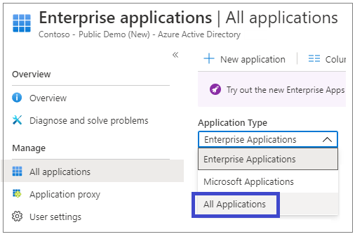
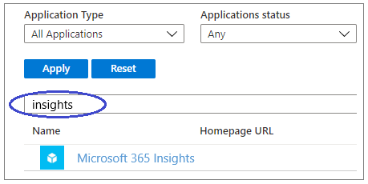
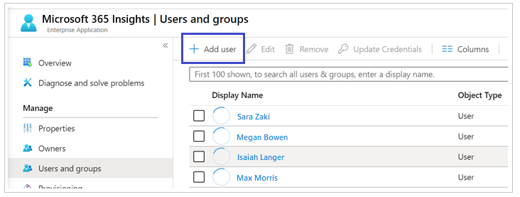
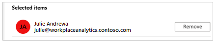
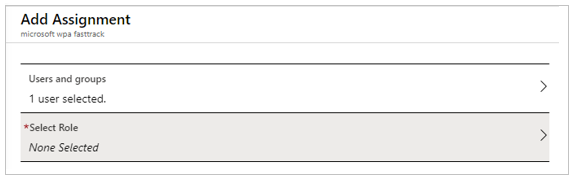

# Assign roles

After assigning licenses, you need to assign users the role of **Insights Business Leader** or **Insights Administrator** in Azure Active Directory (AD). You can assign a role to [individual users](#assign-roles-to-users) or to [groups](#assign-roles-to-groups).

## Assign roles to users

1. The Azure Active Directory admin must sign in to your tenant's [Azure Active Directory admin center](https://aad.portal.azure.com).
2. In left navigation, select **Enterprise applications** to open the **Enterprise applications | All applications**.
3. In the **Application Type** menu, select **All Applications**.

   

4. In the search field, enter **Microsoft 365 Insights**, and then press **Enter**.

   

5. In the search results, select **Microsoft 365 Insights**.  
6. In the **Insights | Overview** page, under **Getting Started**, select **Assign users and groups**.
7. In **Users and groups**, select **Add user**.

   

8. In **Add Assignment**, select **Users and groups**.

   

9. Under **Users and groups** (on the right side of the page), identify the user to whom you want to assign a role. Start typing that person's user identifier (such as their display name or their User Principal Name) in the search field and then select their identifier in the results list. After you select the person, their identifier appears on the right under **Selected items**.

   

   In the **Users and groups** area, the count of selected users will increase by one.

   

   >[!Note]
   >You can repeat this step to add one or more additional users, if you intend to assign the same role to them.

10. In **Add Assignment**, choose **Select Role** to open the **Select Role** area to the right.
11. From the list that appears, select a role:

    * **Insights Business Leader** - Gets read access to the Insights app reports and insights.
    * **Insights Administrator** - Gets full access to the Insights app and read access to Azure AD properties, monitors, service health, and managed service requests.

   >[!Note]
   >The role also appears under **Add Assignment** in the **Select Role** area.

12. After you've chosen the user and the role, select **Assign** at the bottom of the **Add Assignment** page. After a few seconds, a message in the upper right informs you of the success of the role assignment:  

    

    You have now assigned the role to one user.  

## Assign roles to groups

You can also assign the role to one or more groups, which means that you are assigning the access permissions associated with that role to the group. Any users who are assigned to that group automatically receive the same permissions that are assigned to that role.

>[!Note]
>The groups to which you can assign Insight app roles are Azure AD security groups. For more information about working with this kind of group, see [Manage app and resource access using Azure Active Directory groups](https://docs.microsoft.com/azure/active-directory/fundamentals/active-directory-manage-groups).

To assign users and roles to an Insights app group, the steps are similar to those for assigning users, as previously described in **Steps 9-12** in [Assign roles to users](#assign-roles-to-users) where in **Step 9**, instead of selecting a name, select a group, and then assign a role to that group.

If you have not yet created an Insights app group in Azure AD, and want to do so, see [Create a group and add members in Azure Active Directory](https://docs.microsoft.com/azure/active-directory/fundamentals/active-directory-groups-create-azure-portal).

## Access to Insights

After assigning licenses, the data for insights might take up to three days to process and become available. After [assigning roles](assign-roles.md) and allowing for data processing, send your organization's leaders the link to [Insights](https://productivityinsights.office.com) to open and use them. Also, refer them to [Insights introduction](./intro.md) to learn more about how to use Insights.

## Related topic

[Set up insights](setup.md)
