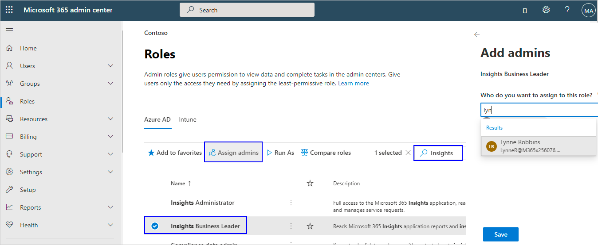

# Assign roles

After assigning licenses, you need to assign users the role of **Insights Business Leader** or **Insights Administrator** in Microsoft 365 admin center.

Do the following to assign roles to individual users.

1. Sign in as a global admin to your tenant's [Microsoft 365 admin center](https://admin.microsoft.com/adminportal).
2. In the left navigation, select **Roles** 
3. In the search field, enter **Insights**.
4. In the search results, select a role:

   * **Insights Administrator** - Gets full access to the Insights app and read access to Azure AD properties, monitors, service health, and managed service requests.
   * **Insights Business Leader** - Gets read access to the Insights app reports and insights.

5. Select **Assign admins**, and then select **+ Add**. 
6. In the search field for **Who do you want to assign to this role**, type the first few letters of a name, and then select the name from the list. The admin center limits you to assigning 20 names at a time. However, you can repeat these steps to assign more users a role.

    

7. Select **Save** to assign the listed users the role.

>[!Note]
>The admin center references all roles as admins even though not all roles are admins.
<!--NOT CURRENTLY AVAILABLE 2/26/21
## Assign roles to groups

You can also assign the role to one or more groups, which means that you are assigning the access permissions associated with that role to the group. Any users who are assigned to that group automatically receive the same permissions that are assigned to that role.

>[!Note]
>The groups to which you can assign Insight app roles are Azure AD security groups. For more information about working with this kind of group, see [Manage app and resource access using Azure Active Directory groups](https://docs.microsoft.com/azure/active-directory/fundamentals/active-directory-manage-groups).

To assign users and roles to an Insights app group, the steps are similar to those for assigning users, as previously described in **Steps 9-12** in [Assign roles to users](#assign-roles-to-users) where in **Step 9**, instead of selecting a name, select a group, and then assign a role to that group.

If you have not yet created an Insights app group in Azure AD, and want to do so, see [Create a group and add members in Azure Active Directory](https://docs.microsoft.com/azure/active-directory/fundamentals/active-directory-groups-create-azure-portal).
-->
## Access to Insights

After assigning licenses, the data for insights might take up to three days to process and become available. After [assigning roles](assign-roles.md) and allowing for data processing, send your organization's leaders the link to [Insights](https://productivityinsights.office.com) to open and use them. Also, refer them to [Insights introduction](./intro.md) to learn more about how to use Insights.

## Related topic

[Set up insights](setup.md)
