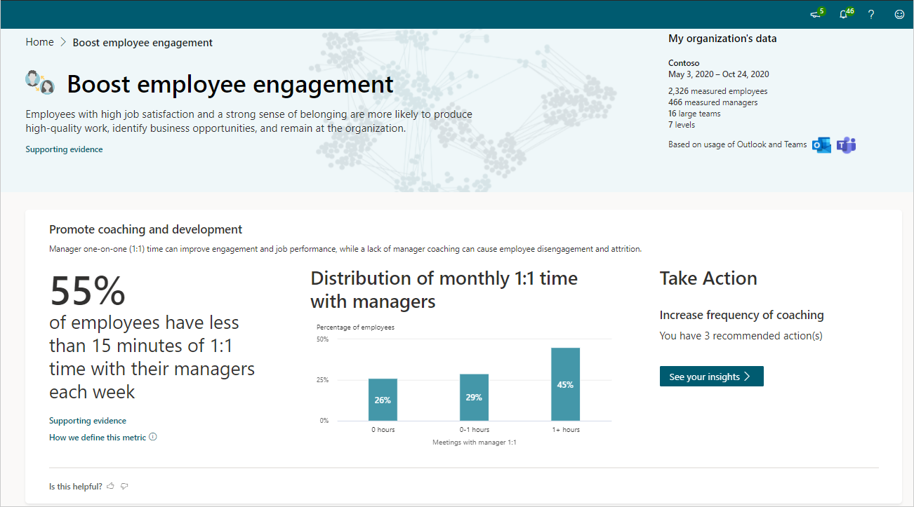

# Boost employee engagement insights

*This experience is only available through private preview.*

Employees with high job satisfaction and a strong sense of belonging are more likely to produce high-quality work, identify business opportunities, and remain at the organization.

For example, are employees routinely getting one-on-one time with their managers? Research shows that employees who get consistent manager coaching are five times more likely to stay engaged, which leads to increased productivity and greater employee retainment.

Each of the behaviors listed show how your organization compares with others based on industry research and your specific organizational data.

## Calculations

The following are the percentage insights, their underlying metrics, and a little about the calculations used for them.

|Behavior |Percentage insight | Metrics |Calculations |
|---------|--------|--------------------|----------------------|
|Promote coaching and development |Percentage of employees who have less than 15 minutes of 1:1 time with their managers each week |[Meeting hours with manager 1:1](metrics.md#meeting-hours-with-manager-1-1-define) |Percentage of employees with less than 15 minutes of weekly 1:1 time with their managers. To account for various 1:1 meeting frequencies, the total time is calculated for each employee per month and averaged over a week. |
|Prevent employee burnout |Percentage of employees who are working after hours for more than one hour each week |[After-hours metrics](metrics.md) |Percentage of employees who spend more than one hour collaborating through emails, calls, instant messages, and meetings outside of working hours. This percentage is calculated weekly and averaged over the entire time period. |
|Drive employee empowerment |Percentage of employees who have a majority of their meetings attended by their manager |[Meeting hours with manager](metrics.md#meeting-hours-with-manager-define) and [meeting hours](metrics.md#meeting-hours-define)|Percentage of employees who spend over 50 percent of their meeting hours with their manager present in the meeting. This percentage is calculated weekly and averaged over the entire time period. |

The following defines the organizational data shown in the visual behavioral insights.

|Behavior |Visual insight | Definition |
|---------|--------|----------------------|
|Promote coaching and development |Distribution of monthly 1:1 time with managers |Percentage of employees based on their monthly meeting hours with managers 1:1. They are divided into employees who have no 1:1s, between zero and one hour, and more than one hour of 1:1s with their manager in a month. These percentages are calculated monthly and averaged over the entire time period. This graph uses the [meeting hours with manager 1:1](metrics.md#meeting-hours-with-manager-1-1-define) metric.|
|Prevent employee burnout | Distribution of weekly after-hours collaboration |Percentage of employees based on their weekly [after-hours collaboration](metrics.md#after-hours-collaboration-define). They are divided into employees who spend less than one hour collaborating after-hours, employees who spend between one to five hours collaborating after-hours, and employees who spend more than five hours collaborating after-hours. These percentages are calculated weekly and averaged over the entire time period. |
|Drive employee empowerment |Distribution of manager-employee coaching relationships |Uses the average time employees spend with [their managers in 1:1s](metrics.md#meeting-hours-with-manager-1-1-define) and the percentage of [meeting hours with manager in attendance](metrics.md#meeting-hours-with-manager-define), the different manager-employee coaching relationships are grouped by employee time percentages: <ul><li>**Coached** - Spend more than 15 minutes in 1:1s (weekly average based on the monthly calculation) and those who spend less than 30 percent of their meeting hours with their managers in attendance.  </li><li>**Co-attended** - Spend less than 15 minutes in 1:1s (weekly average based on the monthly calculation) and those who spend more than 30 percent of their meeting hours with their managers in attendance. </li><li>**Micromanaged** - Spend more than 15 minutes in 1:1s (weekly average based on the monthly calculation) and those who spend more than 30 percent of their meeting hours with their managers in attendance. </li><li>**Under-coached** - Spend less than 15 minutes in 1:1s (weekly average based on the monthly calculation) and employees who have less than 30 percent of their meeting hours with their managers in attendance.</li> |

## Take action

In the **Take action** section for each insight, select **See your insights** to see the most effective actions you can do now to drive change toward better business outcomes in your organization.

You also might see one or more groups listed who are affected and would benefit the most from these recommendations, which are based on your organizational data and industry research.

## Best practices

This section describes why each of the following behaviors matter and the top best practices that can help keep employees engaged.

* [Promote coaching and development](#promote-coaching-and-development)
* [Prevent employee burnout](#prevent-employee-burnout)
* [Drive employee empowerment](#drive-employee-empowerment)

### Promote coaching and development

Manager one-on-one (1:1) time can improve engagement and job performance, while lack of manager coaching can cause employee disengagement and attrition.

One of the top best practices for promoting coaching and development is to require that managers schedule recurring 1:1 meetings with their direct reports for 30 minutes at least twice a month and hold them accountable for achieving that goal. See [Catch up with your team](/viva/insights/personal/use/use-the-insights#catch-up-with-your-team) for help with scheduling and managing your 1:1s.

For more best practices and how to develop a 1:1 conversation series, see [Best practices for manager coaching](/viva/insights/tutorials/gm-coaching).

### Prevent employee burnout

Pressure to "always be on" and long hours can lead to employee burnout. The amount of time employees spend collaborating outside of business hours is an indicator of burnout risk.

Here are some ways to support employee wellbeing::

* Use [personal wellbeing data](/viva/insights/personal/use/wellbeing) to learn about after-hours work habits and encourage your team to take time to disconnect and recharge.
* Use [Inline suggestions in Outlook](/viva/insights/personal/use/mya-notifications#delay-delivery) to automatically delay email delivery to align with configured working hours for coworkers.

For more best practices and how to define and share working hours, see [Best practices for wellbeing](/viva/insights/tutorials/gm-wellbeing).

### Drive employee empowerment

Cultivating autonomy and development are essential for employee engagement. By empowering employees to make decisions and tackle new challenges, enables managers to be more effective and reclaim time.

To empower employees:

* Use [Teams and OneNote](https://support.microsoft.com/office/add-a-onenote-notebook-to-teams-0ec78cc3-ba3b-4279-a88e-aa40af9865c2) to share meeting notes about decisions and action items as an alternative way to keep your team informed.
* Use [Manager insights in Workplace Analytics](/viva/insights/manager-insights/introduction) to help identify ways to support team behavior.

For more best practices and how to set team meeting rules and policy, see [Best practices for meetings](/viva/insights/tutorials/gm-meetings).

