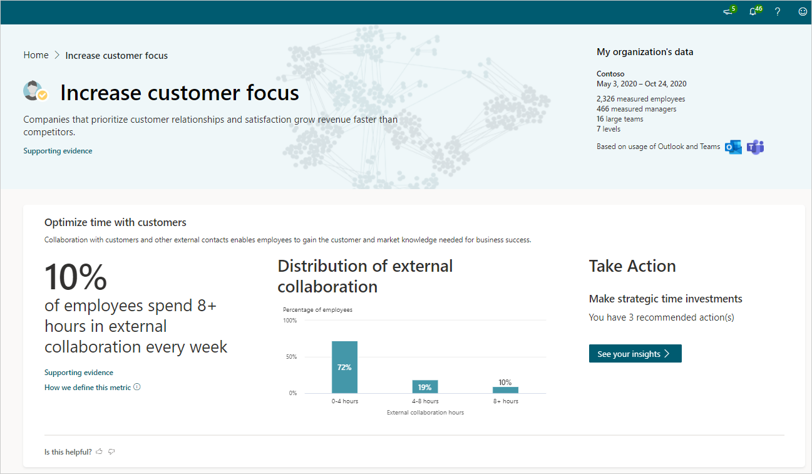

# Increase customer focus insights

*This experience is only available through private preview.*

Companies that prioritize customer relationships and satisfaction grow revenue faster than competitors. Research shows that companies that prioritize customer relationships and satisfaction grow revenue 2.5 times faster than their competitors.

Each of the behaviors listed show how your organization compares with others based on industry research and your specific organizational data.

## Calculations

The following are the percentage insights, their underlying metrics, and a little about the calculations used for them.

|Behavior |Percentage insight | Metrics |Calculations |
|---------|--------|--------------------|----------------------|
|Optimize time with customers  |Percentage of employees who spend 8+ hours in external collaboration every week |[External network size and external collaboration hours](metrics.md) and [connected people and connected groups](glossary.md) |Percentage of employees who spend more than 8 hours collaborating with people outside the company. This insight is calculated weekly and averaged over the entire time period. |
|Promote coaching and development |Percentage of employees who have less than 15 minutes of 1:1 time with their managers each week |[Meeting hours with manager 1:1](metrics.md#meeting-hours-with-manager-1-1-define) |The percentage of employees who spend less than 15 minutes of coaching time with their managers each week. To account for different frequencies in coaching, this percentage is calculated monthly and then divided by four to get a weekly average. |

The following defines the organizational data shown in the visual behavioral insights.

|Behavior |Visual insight |Definition |
|---------|--------|----------------------|
|Optimize time with customers |Distribution of external collaboration |Percentage of employees grouped by their weekly [external collaboration hours](metrics.md#external-collaboration-define). They are divided into groups of employees who spend zero to four0-4 hours, 4-8four to eight hours, and more than eight8+ hours collaborating externally with people outside the company. These percentages are calculated weekly and averaged over the entire time period. |
|Promote coaching and development |Distribution of monthly 1:1 time with managers |Percentage of employees based on their monthly [meeting hours with manager 1:1](metrics.md#meeting-hours-with-manager-1-1-define). They are divided into employees who have no 1:1s, have between zero and one hour, and have more than one hour of 1:1s with their manager in a month. These percentages are calculated monthly and averaged over the entire time period. |

## Take action

In the **Take action** section for each insight, select **See your insights** to see the most effective actions you can do now to drive change toward better business outcomes in your organization.

You also might see one or more groups listed who are affected and would benefit the most from these recommendations, which are based on your organizational data and industry research.

## Best practices

This section describes why each of the following behaviors matter and the top best practices that can help increase customer focus.

* [Optimize time with customers](#optimize-time-with-customers)
* [Promote coaching and development](#promote-coaching-and-development)

### Optimize time with customers

Collaboration with customers and other external contacts enables employees to gain the customer and market knowledge needed for business success. Spending time collaborating with customers helps you better anticipate customer's needs and develop products and services that create real value.

To support customer focus:

* Use the [Important people list](/viva/insights/personal/use/use-the-insights#add-important-people) for key external contacts, which enables immediate notification of email from them, more efficient responses to their requests, and reminders to schedule time to connect with them.
* Create a shared [Teams channel](/microsoftteams/teams-channels-overview) with key customers for direct, informal chats and prompt responses to urgent requests.

For best practices and how to track time with your most important external contacts, see [Best practices for customer collaboration](/viva/insights/tutorials/gm-cust-collab).

### Promote coaching and development

Manager one-on-one (1:1) time can improve engagement and job performance, while lack of manager coaching can cause employee disengagement and attrition.

* Use [Insights](/viva/insights/personal/use/use-the-insights#catch-up-with-your-team) to schedule 1:1 time, receive reminders to do so, and follow up on tasks related to direct reports.
* Require managers to schedule recurring 1:1 meetings with their direct reports for 30 minutes at least twice a month and hold them accountable for achieving that goal.

For more best practices and how to develop a 1:1 conversation series, see [Best practices for manager coaching](/viva/insights/tutorials/gm-coaching).

