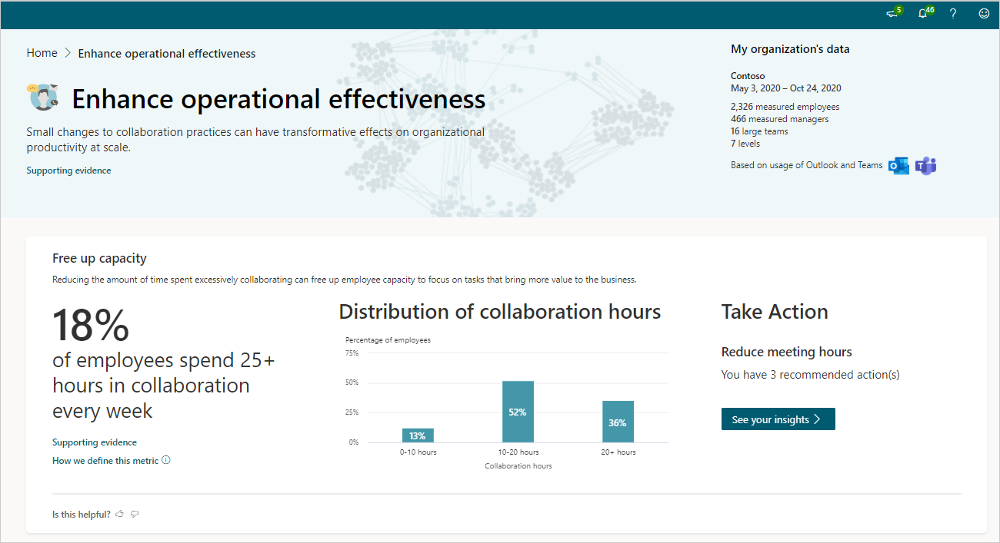

# Enhance operational effectiveness insights

*This experience is only available through private preview at this time.*

Each of the behaviors listed show how your organization compares with others based on industry research and your specific organizational data. Each of the behaviors listed show how your organization compares with others based on industry research and your specific organizational data.

## Calculations

The following are the percentage insights, their underlying metrics, and a little about the calculations used for them.

|Behavior |Percentage insight | Metrics |Calculations |
|---------|--------|--------------------|----------------------|
|Free up capacity |Percentage of employees who 25+ hours in collaboration every week |[Collaboration hours](metrics.md#collaboration-hours-define)|Percentage of employees who spend more than 25 hours each week collaborating through email, calls, instant messages, and meetings. This insight is calculated weekly and averaged for the entire time period. |
|Improve meeting quality |Percentage of employees who spend a majority of their meeting time in long or large meetings |[Long meetings](glossary.md#long-meeting-define), [large meetings](glossary.md#large-meeting-define), and [meeting hours](metrics.md#meeting-hours-define)|The percentage of employees who spent over 50 percent of their meeting hours in long or large meetings. Long meetings are longer than one hour and large meetings have more than eight attendees. This is calculated weekly and averaged for the entire time period. |
|Keep employees engaged |Percentage of employees who significantly multitask in meetings |[Multi-tasking meeting hours](metrics.md#multitasking-meeting-hours-define) |Percentage of employees who spend more than 25 percent of their meetings hours multitasking. This insight is calculated weekly and averaged for the entire time period. |
|Protect time to get work done |Percentage of employees who have less than 20 hours available to focus each week |[Total focus hours](metrics.md#focus-define) |The percentage of employees who have less than 20 hours available to focus each week, which is calculated weekly and averaged for the entire time period. |

The following defines the organizational data shown in the visual behavioral insights.

|Behavior |Visual insight | Definition |
|---------|--------|----------------------|
|Free up capacity |Distribution of collaboration hours  |Percentage of employees based on their weekly [collaboration hours](metrics.md#collaboration-hours-define). They are divided into those who spend between zero and 10 hours, 10 and 20 hours, and more than 20 hours collaborating. These percentages are calculated weekly and averaged for the entire time period. |
|Improve meeting quality |Meetings by duration and number of attendees |Uses [meeting hours](metrics.md#meeting-hours-define) to calculate the following percentages that are calculated weekly and averaged for the entire time period: <ul><li>**Large meetings** - Percentage of meetings that are larger than eight attendees but have a duration of less than one hour. </li><li>**Long meetings** - Percentage of meetings that are longer than one hour but have less than equal to eight attendees. </li><li>**Long and large meetings** - Percentage of meetings that have more than eight attendees and are longer than one hour. </li><li>**Decision-making meetings** - Percentage of meetings that have between two and eight attendees and are less than one hour in duration. </li>|
|Keep employees engaged |Distribution of multitasking in meetings |Percentage of employees based on their weekly [multitasking meeting hours](metrics.md#multitasking-meeting-hours-define). They are divided into those who spend between zero and one hour, one to five hours, and more than five hours. These are calculated weekly and averaged for the entire time period. |
|Protect time to get work done |Distribution of focus time |Percentage of employees grouped by their [total focus hours](metrics.md#focus-define). They are divided into those who spend between zero and 10 hours, 10 and 20 hours, 20 and 40 hours, and more than 40 hours focusing. These are calculated weekly and averaged for the entire time period. |

## Take action

In the **Take action** section for each insight, select **See your insights** to see the most effective actions you can do now to drive change toward better business outcomes in your organization.

You also might see one or more groups listed who are affected and would benefit the most from these recommendations, which are based on your organizational data and industry research.

## Best practices

This section describes why each of the following behaviors matter and the top best practices that can help enhance operational effectiveness.

* [Free up capacity](#free-up-capacity)
* [Improve meeting quality](#improve-meeting-quality)
* [Keep employees engaged](#keep-employees-engaged)
* [Protect time to get work done](#protect-time-to-get-work-done)

### Free up capacity

Reducing the amount of time wasted on low-quality collaboration is a way to create capacity for activities that create business value.

As explained in [How to finally kill the useless, recurring meeting](https://hbr.org/2015/03/how-to-finally-kill-the-useless-recurring-meeting), it's not only that the meeting provides little value or that people are multitasking; it's that "the sheer amount of time invested in these low-value interactions is a high-cost impediment to getting things done." Ways to reduce meeting time:

* Cancel any recurring meetings that might no longer be needed. Every quarter reassess the need for recurring meetings that consume the most time. Try canceling some, and then add them back if they’re missed.
* Use [MyAnalytics wellbeing](https://docs.microsoft.com/workplace-analytics/myanalytics/use/wellbeing) to learn about your after-hours work habits and use [Inline suggestions in Outlook](https://docs.microsoft.com/workplace-analytics/myanalytics/use/mya-notifications#delay-email-delivery) to automatically delay email delivery to align with configured working hours for coworkers.
* Reduce meeting hours by scheduling shorter meetings (such as only 15 minutes) with focused agendas. Short stand-up meetings are common in high-stakes workplaces to debrief or reflect on an event.

For more best practices and ways to schedule shorter meetings, see [Best practices for meetings](https://docs.microsoft.com/workplace-analytics/tutorials/gm-meetings).

### Improve meeting quality

Long and large meetings are costly and often considered a waste of time. Shorter meetings with fewer people can enhance individual and team performance.

[The condensed guide to running meetings](https://insights.office.com/collaboration/how-to-run-effective-meetings-and-stop-wasting-time/) explains a few new ideas that can help make your meetings more effective, such as if "you want people to have the opportunity to contribute, you need to limit attendance." Ways to optimize meetings:

* Use [MyAnalytics](https://docs.microsoft.com/workplace-analytics/myanalytics/use/mya-notifications#shorten-a-meeting) to shorten meetings. For example, when you're composing a meeting invitation with a duration of one hour, an inline suggestion will remind you to shorten the meeting by 15 minutes.
* Invite fewer people. When preparing the agenda, include the purpose of each participant's attendance. This exercise can reveal unnecessary invitees, including people who are optional or only require meeting notes.

For more best practices and ways to schedule shorter meetings, see [Best practices for meetings](https://docs.microsoft.com/workplace-analytics/tutorials/gm-meetings).

### Keep employees engaged

Email and chat activity during meetings unrelated to meeting goals can lead to different interpretations of decisions, missed guidance, and inconsistent follow-through on action items.

[If you multitask during meetings, your team will too](https://insights.office.com/productivity/multitask-meetings-team-will/) explains "multitasking can signal to others that we don’t value their time or their contributions. When you and your entire team engages in this behavior, little good can come from it." Ways to keep employees engaged:

* Use the [MyAnalytics Insights to prepare for meetings](https://docs.microsoft.com/workplace-analytics/myanalytics/use/use-the-insights#prepare-for-your-meetings). It provides insights about meeting information, related documents, and reminders to book preparation time.
* Prepare thoughtful agendas that clearly state meeting goals and the purpose of each participant's attendance. Frame agenda topics as questions to focus and prime discussions.
* People have short attention spans. To keep meeting participants engaged during longer meetings, structure agendas in 15-minute increments and take mini-breaks.

For more best practices and ways to maintain the interest and participation of meeting attendees, see [Best practices for meetings](https://docs.microsoft.com/workplace-analytics/tutorials/gm-meetings).

### Protect time to get work done

Time without meetings, emails and chats provides employees with the opportunity to get important work done and think creatively.

[How to establish a meeting-free day each week](https://insights.office.com/time-management/how-to-establish-a-meeting-free-day-each-week/) explains the "goal is uninterrupted focus" time to work "on projects that require focus and high-level thinking, such as writing, strategic thinking, analysis, coding, designing, or a project with a lot of complexity." Ways to protect time:

* Use the [MyAnalytics Focus plan](https://docs.microsoft.com/workplace-analytics/myanalytics/use/focus-plan) to automatically book focus time and protect this time by silencing chats, and allows you to track your progress weekly.
* Create a new team norm that respects the Microsoft Teams focus status of others by not sending chats to teammates whose status is "focusing."

For more best practices and ways to protect the time of yourself and others, see [Best practices for focus time](https://docs.microsoft.com/workplace-analytics/tutorials/gm-focus).
