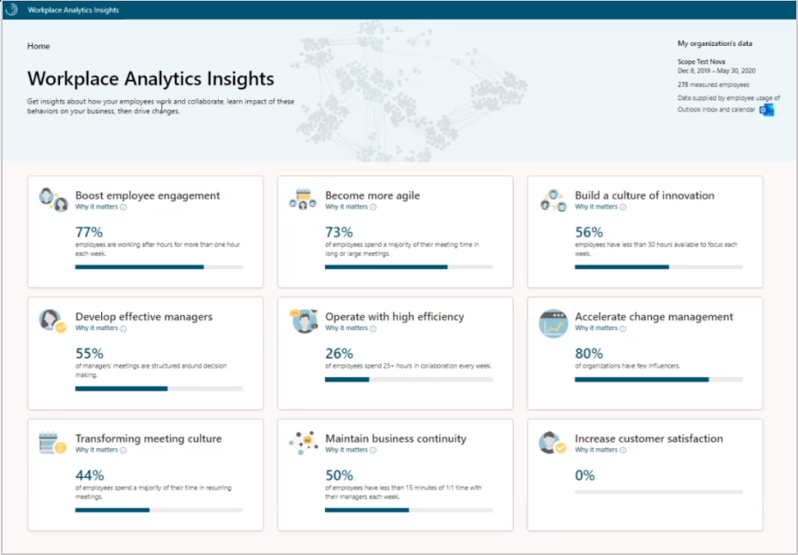

---

ROBOTS: NOINDEX,NOFOLLOW
title: Introducing Workplace Analytics insights
description: About Workplace Analytics insights to learn how your organization gets work done
author: madehmer
ms.author: madehmer
ms.topic: conceptual
localization_priority: normal 
ms.prod: mya

---
# Introducing Workplace Analytics insights

As a business leader, understanding how your employees work together is important. Workplace Analytics insights shows how your employees get work done and collaborate that can help you make business decisions accordingly.

## Your organizational data

The top right of the page shows who in your organization is included in this analysis. This data is based on the most recent organizational data processed in your Azure Active Directory environment, including the current date range and the number of measured employees in your organization.

## Business outcomes

The most common employee behaviors are grouped into nine top business outcomes that have the most impact on your bottom line. These business outcomes are proven to affect how successful organizations are, such as: developing effective managers, boosting employee engagement, building a culture of innovation, and increasing customer satisfaction.

Each business outcome includes a top-level "Why it matters" explanation about how your organization compares to those who have been successful by supporting behaviors that positively affect their business.

As you deep dive into each business outcome, you'll see the top leading indicators and behaviors with more details about why it matters to your organization and the behaviors you can focus time on that can lead to business success. See [Behaviors](behaviors.md) for more details.

## Supporting evidence and Best practices

Each insight includes **Supporting evidence** and **Best practices** that link you to related information, such as [Microsoft Workplace Insights](https://insights.office.com/), which are authored by:

* Industry experts who are basing their insights on research.
* Organizations that have effectively used Workplace Analytics to improve their business outcomes.

## Advanced analysis

Workplace Analytics gives you access to more advanced analysis tools and ways of exploring and reporting about your organization's collaboration data. See [Microsoft Workplace Analytics](https://microsoft.com/microsoft-365/business/workplace-analytics) to learn more about purchasing Workplace Analytics.
