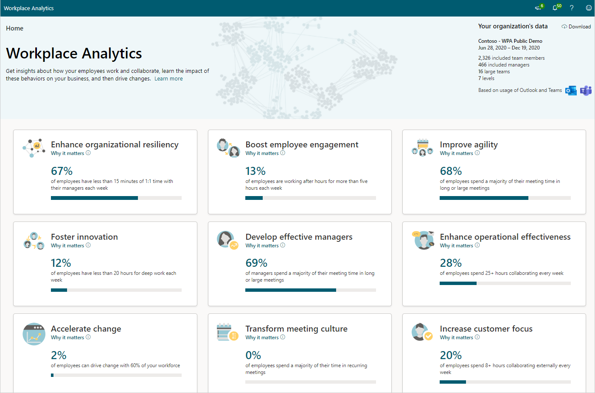

# Insights introduction

*This experience is only available through private preview at this time.*

As a business leader, understanding how your employees work together is important. Microsoft Insights shows how your employees get work done and collaborate that can help you make business decisions accordingly.

This new release is currently limited to Microsoft or Office 365 E5 or E3 plan subscribers through your Microsoft service representative.

You can request access and get more information at [Microsoft insights](https://www.microsoft.com/microsoft-365/business/workplace-analytics). Select **Contact us** and complete the form to request access and get more information about Insights.

After your admin has completed the [Setup steps](./setup.md), the data for insights might take up to three days to process and become available. After the data is processed for your organization, go to [Insights](https://productivityinsights.office.com) to view them.

## Your organizational data

The top right of the page shows who in your organization is included in this analysis. This data is based on the most recent organizational data processed in your Microsoft Azure Active Directory environment, including the current date range and the number of measured employees, managers, teams, and organizational levels. For more details, see [Data privacy](privacy.md).

>[!Important]
>Only data about users whose [geo location is North America](https://docs.microsoft.com/microsoft-365/enterprise/microsoft-365-multi-geo#microsoft-365-multi-geo-availability) is included in this initial release.

## Business outcomes

Each of the following business outcomes has a page dedicated to analysis about your organization and research-based suggestions on how to maintain or drive change toward business success.

You can select **Download** in the top right to create and view a PowerPoint version of the following business outcomes. This enables you to share this valuable data with people in your organization who do not have access to Insights.

|Business outcome |Why it matters |
|-----------------|--------------|
|[Enhance organizational resiliency](resilient-organizations.md) |Small changes to collaboration practices can have transformative effects on organizational productivity at scale. |
|[Boost employee engagement](boost-engagement.md) |Employees with high job satisfaction and a strong sense of belonging are more likely to produce high-quality work, identify business opportunities and remain at the organization. |
|[Improve agility](improve-agility.md) |Companies that redefine industries and lead markets are less bureaucratic and nimbly adapt to rapid changes in technology and customer needs. |
|[Foster innovation](foster-innovation.md) |Employees who share information, prioritize learning, and protect time for deep thinking generate the new ideas needed for success in rapidly evolving markets.|
|[Develop effective managers](develop-managers.md) |Managers have a large impact on employee engagement, development, and performance, and are pivotal for driving organizational change. |
|[Enhance operational effectiveness](effective-operations.md) |Small changes to collaboration practices can have transformative effects on organizational productivity at scale. |
|[Accelerate change](accelerate-change.md) |Slow adoption of new technology harms efforts to attract and retain top talent, improve productivity and can lead to market failure. |
|[Transform meeting culture](transform-meetings.md) |Meetings are essential for collaboration, however unnecessary meetings and bad practices can harm engagement and limit productivity. |
|[Increase customer focus](customer-focus.md) |Companies that prioritize customer relationships and satisfaction grow revenue faster than competitors.|

## Supporting evidence

Each insight includes **Supporting evidence** that links you to related information, such as [Microsoft Insights](https://insights.office.com/) authored by:

* Industry experts based on research
* Organizations who have effectively used this type of analysis to improve their business outcomes

## Take action

In the **Take action** section for each insight, select **See your insights** to see the most effective actions you can do now to drive change toward better business outcomes in your organization.

You also might see one or more groups listed who are affected and would benefit the most from these recommendations, which are based on your organizational data and industry research.

## Advanced analysis

Workplace Analytics gives you access to more advanced analysis tools and ways of exploring and reporting analysis about your organization's collaboration data. See [Microsoft Workplace Analytics](https://microsoft.com/microsoft-365/business/workplace-analytics) to learn more about purchasing and using Workplace Analytics.
