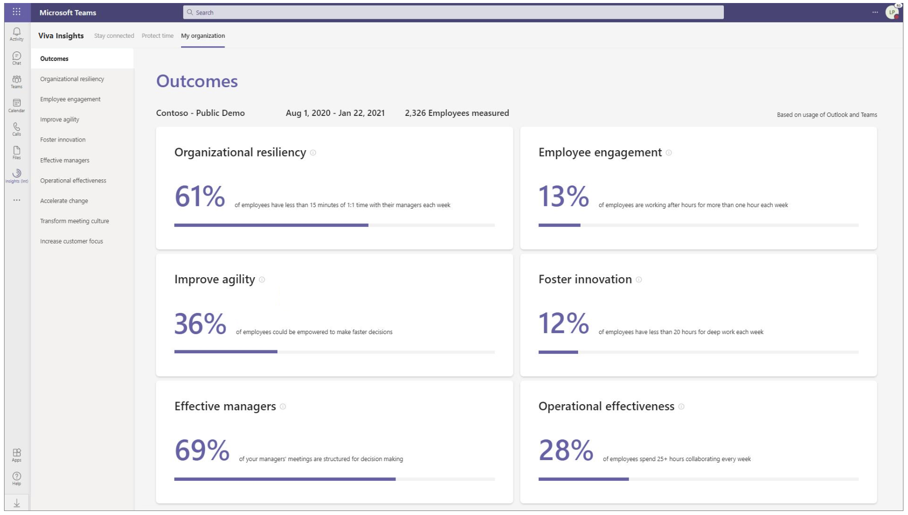
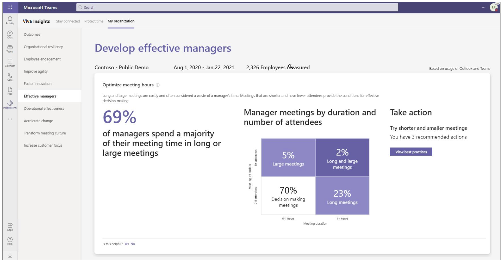

# My organization in Viva Insights

*This experience is only available through private preview at this time.*

>[!Important]
>Starting in March 2022, this product will no longer be available. You can access the same insights with [Microsoft Viva Insights](https://www.microsoft.com/microsoft-viva/insights/).

You can view leader insights on the **My organization** page of the Microsoft Viva Insights app in Microsoft Teams. These insights give you a snapshot of how your company is doing. They do this by presenting company-wide outcomes to focus on, and by showing leading indicators for each outcome, which help you see why it's important to pay attention to that outcome:  

The top right of the page shows who in your organization is included in this analysis. This data is based on the most recent organizational data processed in your Microsoft Azure Active Directory environment, including the current date range and the number of measured employees, managers, teams, and organizational levels. For more details, see [Data privacy](privacy.md).

## View the page

1. On the Teams app bar (the left navigation bar), select **Insights**:

   

2. The Home page of the Insights app opens. Notice the card in the upper right. This card displays a random insight from one of the My organization outcomes. To learn more about this insight, select the **Explore more** option on this card.

   

   You can also use any of the other features on this page, such as **Reflect**, **Praise**, **Stay connected**, and **Protect time**. For more information about these Home page features, see [Viva Insights Home page](/insights/viva-insights-home).

3. On the menu bar at the top of the page, select **My organization**. The My organization page opens to show the following outcomes:

   * Organizational resiliency
   * Employee engagement
   * Improve agility
   * Foster innovation
   * Effective managers
   * Operational effectiveness
   * Accelerate change
   * Transform meeting culture
   * Increase customer focus

   

4. Inspect the outcomes and the statistics that they show. Do you see any red flags that might cause you to take action?  

## Outcome insights

To investigate further, select one of the outcomes to see the insights for that outcome. For example, on the **Outcomes** page, select **Effective managers** to see the **Develop effective managers** insights:

Similarly, you can select **Boost employee engagement** on the Outcomes page to see the **Boost employee engagement** insights:

## Best practices

To learn about taking action on an outcome, you can view related best practices. For example, for **Boost employee engagement**, select **View best practices** to see details about **Increase frequency of coaching**.

## Advanced analysis

Microsoft Viva Insights in the cloud-based Workplace Analytics app give you access to more advanced analysis tools and ways of exploring and reporting analysis about your organization's collaboration data. See [Microsoft Viva Insights in Workplace Analytics](https://microsoft.com/microsoft-365/business/workplace-analytics) to learn more about purchasing and using Viva Insights in Workplace Analytics.
