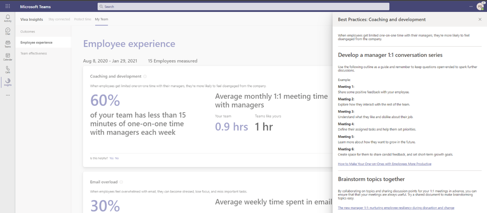

# My team in Viva Insights

*This experience is only available through private preview at this time.*

>[!Important]
>Starting in March 2022, this product will no longer be available. You can access the same insights with [Microsoft Viva Insights](https://www.microsoft.com/microsoft-viva/insights/).

You can view manager insights on the **My team** page in the Microsoft Viva Insights app in Microsoft Teams. Manager insights provide visibility into team collaboration patterns that are leading indicators for overall employee experience and wellbeing.

While you can also see these outcome-based insights and their related best practices in Workplace Analytics, it's advantageous to find them in Teams, the tool that you're already using for communicating during remote work, the tool you use for meeting, sharing files, and sending IMs to employees and other leaders.

## View the page

1. On the Teams app bar (the left navigation bar), select **Insights**:

   

2. The Home page of the Insights app opens. Notice the card in the upper right. This card displays a random insight from one of the My team outcomes. To learn more about this insight, select the **Explore more** option on this card.

   

   You can also use any of the other features on this page, such as **Reflect**, **Praise**, **Stay connected**, and **Protect time**. For more information about these Home page features, see [Viva Insights Home page](/insights/viva-insights-home).

3. On the menu bar at the top of the page, select **My team** to see the following outcomes:

   * Employee experience
   * Team effectiveness

4. Inspect the outcomes and the statistics that they show. Do you see any red flags that might cause you to take action?  

## Outcome insights

To investigate further, select one of the outcomes to see the insights for that outcome. For example, on the **Outcomes** page, select **Employee experience** to see the **Coaching and development** insights:

## Best practices

To take action for an outcome, select **View best practices** to see related recommendations for it. For example, on the **Boost employee engagement** insight, select **View best practices** to see details about **Increase frequency of coaching**:

## Advanced analysis

Microsoft Viva Insights in the cloud-based Workplace Analytics app give you access to more advanced analysis tools and ways of exploring and reporting analysis about your organization's collaboration data. See [Microsoft Viva Insights in Workplace Analytics](https://microsoft.com/microsoft-365/business/workplace-analytics) to learn more about purchasing and using Viva Insights in Workplace Analytics.
