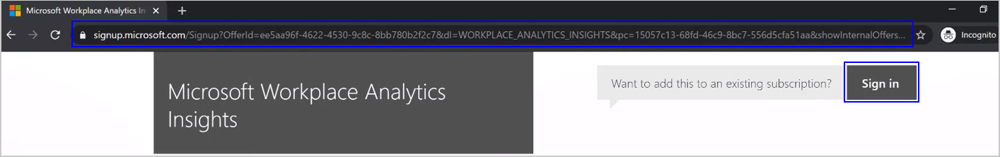

# Set up Advanced insights

*This experience is only available through private preview at this time.*

>[!Important]
>Starting in March 2022, this product will no longer be available. You can access the same insights with [Microsoft Viva Insights](https://www.microsoft.com/microsoft-viva/insights/).

Before people in your organization can view and use Microsoft Viva Insights, your Microsoft 365 global admin needs to do the following for them:

1. [Activate promotional codes](#activate-promotional-codes)
2. [Assign licenses](#assign-licenses)
3. [Assign roles](assign-roles.md)
4. [Deploy the app](deploy.md)

This new release is currently limited to Microsoft 365 or Office 365 E5 or E3 plan subscribers through their Microsoft service representative.

You can request access and get more information at [Advanced insights with Microsoft Viva Insights](https://www.microsoft.com/microsoft-365/business/workplace-analytics). Select **Contact us** and complete the form to request access and get more information about Viva Insights.

## Activate promotional codes

1. Depending on which browser you are using, on the Windows taskbar or Start menu, right-click the browser application and select **Start InPrivate Browsing**, **New InPrivate window**, **New incognito window**, or **New private window**.
2. Copy the **activation code link** that Microsoft sent you for Viva Insights, paste it into the URL section of the private or incognito browser window, and then press **Enter** to open the link.

   

3. When prompted, enter your email address.
4. Sign in with your Microsoft 365 or Office 365 global admin credentials, and then select **Next**.
5. In **Check out** > **confirm you order** > **Microsoft Viva Insights trial**, select **Try now**.
6. When prompted in **order receipt**, select **Continue**.

## Assign licenses

You can assign licenses to people in your organization who subscribe to a Microsoft 365 or Office 365 E5 or E3 plan. To do this, you sign in to the Microsoft admin center as a global Microsoft 365 admin.

You can assign licenses as follows:

* [Assign licenses to individual users with the Microsoft 365 admin center](assign-licenses.md)
* [Assign licenses to security groups with Microsoft Entra ID](assign-licenses.md)
* [Assign licenses to users with Microsoft PowerShell](assign-licenses-pshell.md)

## Deploy the app

[Teams Service Administrators](/microsoftteams/using-admin-roles#teams-roles-and-capabilities) can choose to deploy and pin the app for all users or particular departments [through custom policies](/microsoftteams/teams-app-setup-policies).

See [Deploy the app](deploy.md) for steps on how to deploy.

## Access to Viva Insights

After assigning licenses and deploying the app, the data for Viva Insights might take up to a week to process and become available. After completing the required setup tasks and allowing for data processing, refer your organization's leaders to [Install and pin the app](install.md) to open and use them. Also, refer them to [Viva Insights introduction](./intro.md) to learn more about how to use them.
